Alicia Sigmon

als333@pitt.edu 

12/03/17

# Discourse Analysis of the Australian Radio Talkback Corpus

This file starts where [process-art-corpus.md](https://github.com/Data-Science-for-Linguists/Discourse-Analysis-ART-Corpus/blob/master/process-art-corpus.md) left off, and is the analysis portion of this project.

### Table of Contents
- [About the Data](#About-the-Data)
- [Plan](#Plan)
- [Reading in Data Frames](#Reading-in-Data-Frames)
    - [Data Frames Summary](#Data-Frames-Summary)
    - [Splitting Speakers by Role](#Splitting-Speakers-by-Role)
    - [All Presenters](#All-Presenters)
- [Distribution of Speakers](#Distribution-of-Speakers)
    - [How many Speakers are there for each Role?](#How-many-Speakers-are-there-for-each-Role?)
    - [How many Males vs. Females?](#How-many-Males-vs.-Females?)
    - [How are Males and Females distributed across Roles?](#How-are-Males-and-Females-distributed-across-Roles?)
        - [Gender Equality](#Gender-Equality)
- [Comparison by Speaker Type](#Comparison-by-Speaker-Type)
    - [Analysis](#Analysis)
- [Comparison by Gender](#Comparison-by-Gender)
- [Back Channels](#Back-Channels)
    - [What are the Back Channels? Which ones are most common?](#What-are-the-Back-Channels?-Which-ones-are-most-common?)
    - [What Speaker Type has the most Back Channels?](#What-Speaker-Type-has-the-most-Back-Channels?)
    - [What Speaker Type has the most number of Back Channels uttered during their lines?](#What-Speaker-Type-has-the-most-number-of-Back-Channels-uttered-during-their-lines?)
    - [What Gender utters the most Back Channels?](#What-Gender-utters-the-most-Back-Channels?)
    - [What Gender has the most Back Channels uttered while they are speaking?](#What-Gender-has-the-most-Back-Channels-uttered-while-they-are-speaking?)
    - [Are Men more likely to utter Back Channels when a Women or Man is speaking? How about the other way around?](#Are-Men-more-likely-to-utter-Back-Channels-when-a-Women-or-Man-is-speaking?-How-about-the-other-way-around?)
    - [How do Male and Female Most Common Back Channels Compare?](#How-do-Male-and-Female-Most-Common-Back-Channels-Compare?)
- [Presenter Gender Analysis](#Presenter-Gender-Analysis)
    - [Making Data Frames](#Making-Data-Frames)
    - [Presenter Distribution](#Presenter-Distribution)
    - [Presenter Gender Statistics](#Presenter-Gender-Statistics)
- [Caller Gender Back Channel Analysis](#Caller-Gender-Back-Channel-Analysis)
    - [Data Frame of Caller Back Channels](#Data-Frame-of-Caller-Back-Channels)
    - [Data Frame of Caller Lines with Back Channels](#Data-Frame-of-Caller-Lines-with-Back-Channels)
    - [How Gender Alone Affects Back Channels](#How-Gender-Alone-Affects-Back-Channels)
- [Conclusion](#Conclusion)

## About the Data
- 27 transcribed recordings of samples of national, regional and commercial Australian talkback radio from 2004 to 2006.
- *raw files* and text files
- Closed Data


## Plan 
- Original Format
- Formatting
- Speaker Analyses
- Gender Analyses 
- Back Channel Analyses


```python
%pprint
```

    Pretty printing has been turned OFF
    


```python
from IPython.core.interactiveshell import InteractiveShell
InteractiveShell.ast_node_interactivity = "all"
```


```python
import nltk
import pandas as pd

# visualization tools
import matplotlib as mpl
import matplotlib.pyplot as plt
plt.style.use('classic')
```

## Reading in Data Frames


```python
# reading in data frames
speaker_df=pd.read_csv("data_files/Speakers.csv")
art_df=pd.read_csv("data_files/Texts.csv")
bk_df=pd.read_csv("data_files/Back_Channels.csv")

# speaker_df.head()
# art_df.head()
# bk_df.head()
```

### Data Frames Summary

- speaker_df
    - data frame of all unique speakers
- art_df
    - data frame of each line of text
- bk_df
    - data frame of all back channels


```python
# modifying data frame column names
speaker_df.columns = ["Speaker","Segment","Speaker_Type","Gender","Name","Number_of_Utterances"]
speaker_df = speaker_df.set_index("Speaker")

print("Speaker Data Frame:")
speaker_df.head()

art_df.columns = ["Speaker","Utterance_Number","Segment","Speaker_Type","Gender","Text","Word_Toks","Num_Words","Avg_Word_Length","Sents","Num_Sents"]
art_df = art_df.set_index(keys=["Speaker","Utterance_Number"])

print("Lines of Text Data Frame:")
art_df.head()

bk_df.columns = ["","Speaker","Speaker_Type","Speaker_Gender","Back_Channel","Line_Speaker","Segment_Utterance_Number","Segment","Line_Speaker_Type","Line_Speaker_Gender"]
bk_df = bk_df.set_index("")

print("Back Channel Data Frame:")
bk_df.head()
```

    Speaker Data Frame:
    


<div>
<style scoped>
    .dataframe tbody tr th:only-of-type {
        vertical-align: middle;
    }

    .dataframe tbody tr th {
        vertical-align: top;
    }

    .dataframe thead th {
        text-align: right;
    }
</style>
<table border="1" class="dataframe">
  <thead>
    <tr style="text-align: right;">
      <th></th>
      <th>Segment</th>
      <th>Speaker_Type</th>
      <th>Gender</th>
      <th>Name</th>
      <th>Number_of_Utterances</th>
    </tr>
    <tr>
      <th>Speaker</th>
      <th></th>
      <th></th>
      <th></th>
      <th></th>
      <th></th>
    </tr>
  </thead>
  <tbody>
    <tr>
      <th>ABCE1-C1</th>
      <td>ABCE1</td>
      <td>C</td>
      <td>F</td>
      <td>Suzanne</td>
      <td>17</td>
    </tr>
    <tr>
      <th>ABCE1-C10</th>
      <td>ABCE1</td>
      <td>C</td>
      <td>F</td>
      <td>Beth</td>
      <td>17</td>
    </tr>
    <tr>
      <th>ABCE1-C11</th>
      <td>ABCE1</td>
      <td>C</td>
      <td>F</td>
      <td>Lynne</td>
      <td>10</td>
    </tr>
    <tr>
      <th>ABCE1-C12</th>
      <td>ABCE1</td>
      <td>C</td>
      <td>M</td>
      <td>Jack</td>
      <td>12</td>
    </tr>
    <tr>
      <th>ABCE1-C2</th>
      <td>ABCE1</td>
      <td>C</td>
      <td>F</td>
      <td>Lisa</td>
      <td>13</td>
    </tr>
  </tbody>
</table>
</div>


    Lines of Text Data Frame:
    


<div>
<style scoped>
    .dataframe tbody tr th:only-of-type {
        vertical-align: middle;
    }

    .dataframe tbody tr th {
        vertical-align: top;
    }

    .dataframe thead th {
        text-align: right;
    }
</style>
<table border="1" class="dataframe">
  <thead>
    <tr style="text-align: right;">
      <th></th>
      <th></th>
      <th>Segment</th>
      <th>Speaker_Type</th>
      <th>Gender</th>
      <th>Text</th>
      <th>Word_Toks</th>
      <th>Num_Words</th>
      <th>Avg_Word_Length</th>
      <th>Sents</th>
      <th>Num_Sents</th>
    </tr>
    <tr>
      <th>Speaker</th>
      <th>Utterance_Number</th>
      <th></th>
      <th></th>
      <th></th>
      <th></th>
      <th></th>
      <th></th>
      <th></th>
      <th></th>
      <th></th>
    </tr>
  </thead>
  <tbody>
    <tr>
      <th>ABCE1-P1</th>
      <th>1</th>
      <td>ABCE1</td>
      <td>P</td>
      <td>M</td>
      <td>Thanks for that John Hall now John Hall will b...</td>
      <td>['Thanks', 'for', 'that', 'John', 'Hall', 'now...</td>
      <td>80</td>
      <td>4.700000</td>
      <td>["Thanks for that John Hall now John Hall will...</td>
      <td>2</td>
    </tr>
    <tr>
      <th>ABCE1-E1</th>
      <th>2</th>
      <td>ABCE1</td>
      <td>E</td>
      <td>M</td>
      <td>I guess yeah yeah &lt;laughs&gt;.</td>
      <td>['I', 'guess', 'yeah', 'yeah', '.']</td>
      <td>5</td>
      <td>3.000000</td>
      <td>['I guess yeah yeah .']</td>
      <td>1</td>
    </tr>
    <tr>
      <th>ABCE1-P1</th>
      <th>3</th>
      <td>ABCE1</td>
      <td>P</td>
      <td>M</td>
      <td>He's also known &lt;E1 sounds reasonable&gt; for his...</td>
      <td>['He', "'s", 'also', 'known', 'for', 'his', 'a...</td>
      <td>159</td>
      <td>5.062893</td>
      <td>["He's also known  for his ability to open cos...</td>
      <td>3</td>
    </tr>
    <tr>
      <th>ABCE1-E1</th>
      <th>4</th>
      <td>ABCE1</td>
      <td>E</td>
      <td>M</td>
      <td>Okay.</td>
      <td>['Okay', '.']</td>
      <td>2</td>
      <td>2.500000</td>
      <td>['Okay.']</td>
      <td>1</td>
    </tr>
    <tr>
      <th>ABCE1-P1</th>
      <th>5</th>
      <td>ABCE1</td>
      <td>P</td>
      <td>M</td>
      <td>Jeanne Villani does and we'll find out the sec...</td>
      <td>['Jeanne', 'Villani', 'does', 'and', 'we', "'l...</td>
      <td>50</td>
      <td>3.980000</td>
      <td>["Jeanne Villani does and we'll find out the s...</td>
      <td>1</td>
    </tr>
  </tbody>
</table>
</div>


    Back Channel Data Frame:
    


<div>
<style scoped>
    .dataframe tbody tr th:only-of-type {
        vertical-align: middle;
    }

    .dataframe tbody tr th {
        vertical-align: top;
    }

    .dataframe thead th {
        text-align: right;
    }
</style>
<table border="1" class="dataframe">
  <thead>
    <tr style="text-align: right;">
      <th></th>
      <th>Speaker</th>
      <th>Speaker_Type</th>
      <th>Speaker_Gender</th>
      <th>Back_Channel</th>
      <th>Line_Speaker</th>
      <th>Segment_Utterance_Number</th>
      <th>Segment</th>
      <th>Line_Speaker_Type</th>
      <th>Line_Speaker_Gender</th>
    </tr>
    <tr>
      <th></th>
      <th></th>
      <th></th>
      <th></th>
      <th></th>
      <th></th>
      <th></th>
      <th></th>
      <th></th>
      <th></th>
    </tr>
  </thead>
  <tbody>
    <tr>
      <th>0</th>
      <td>ABCE1-E1</td>
      <td>E</td>
      <td>M</td>
      <td>sounds reasonable</td>
      <td>ABCE1-P1</td>
      <td>3</td>
      <td>ABCE1</td>
      <td>P</td>
      <td>M</td>
    </tr>
    <tr>
      <th>1</th>
      <td>ABCE1-C1</td>
      <td>C</td>
      <td>F</td>
      <td>laughs</td>
      <td>ABCE1-P1</td>
      <td>10</td>
      <td>ABCE1</td>
      <td>P</td>
      <td>M</td>
    </tr>
    <tr>
      <th>2</th>
      <td>ABCE1-P1</td>
      <td>P</td>
      <td>M</td>
      <td>yes</td>
      <td>ABCE1-C1</td>
      <td>11</td>
      <td>ABCE1</td>
      <td>C</td>
      <td>F</td>
    </tr>
    <tr>
      <th>3</th>
      <td>ABCE1-E1</td>
      <td>E</td>
      <td>M</td>
      <td>mm</td>
      <td>ABCE1-C1</td>
      <td>11</td>
      <td>ABCE1</td>
      <td>C</td>
      <td>F</td>
    </tr>
    <tr>
      <th>4</th>
      <td>ABCE1-E1</td>
      <td>E</td>
      <td>M</td>
      <td>mm</td>
      <td>ABCE1-C1</td>
      <td>11</td>
      <td>ABCE1</td>
      <td>C</td>
      <td>F</td>
    </tr>
  </tbody>
</table>
</div>


### Splitting Speakers by Role


```python
# dataframe of presenters
P_df=speaker_df.loc[speaker_df["Speaker_Type"]=='P',:]

# dataframe of callers
C_df=speaker_df.loc[speaker_df["Speaker_Type"]=='C',:]

# dataframe of experts
E_df=speaker_df.loc[speaker_df["Speaker_Type"]=='E',:]
```

### All Presenters


```python
P_df
```


<div>
<style scoped>
    .dataframe tbody tr th:only-of-type {
        vertical-align: middle;
    }

    .dataframe tbody tr th {
        vertical-align: top;
    }

    .dataframe thead th {
        text-align: right;
    }
</style>
<table border="1" class="dataframe">
  <thead>
    <tr style="text-align: right;">
      <th></th>
      <th>Segment</th>
      <th>Speaker_Type</th>
      <th>Gender</th>
      <th>Name</th>
      <th>Number_of_Utterances</th>
    </tr>
    <tr>
      <th>Speaker</th>
      <th></th>
      <th></th>
      <th></th>
      <th></th>
      <th></th>
    </tr>
  </thead>
  <tbody>
    <tr>
      <th>ABCE1-P1</th>
      <td>ABCE1</td>
      <td>P</td>
      <td>M</td>
      <td>Simon Marnie</td>
      <td>155</td>
    </tr>
    <tr>
      <th>ABCE2-P1</th>
      <td>ABCE2</td>
      <td>P</td>
      <td>M</td>
      <td>Simon Marnie</td>
      <td>233</td>
    </tr>
    <tr>
      <th>ABCE3-P1</th>
      <td>ABCE3</td>
      <td>P</td>
      <td>F</td>
      <td>Lynne Haultain</td>
      <td>129</td>
    </tr>
    <tr>
      <th>ABCE3-P2</th>
      <td>ABCE3</td>
      <td>P</td>
      <td>F</td>
      <td>Jurate Sasnaitis</td>
      <td>56</td>
    </tr>
    <tr>
      <th>ABCE4-P1</th>
      <td>ABCE4</td>
      <td>P</td>
      <td>F</td>
      <td>Kelly Higgins-Devine</td>
      <td>23</td>
    </tr>
    <tr>
      <th>ABCNE1-P1</th>
      <td>ABCNE1</td>
      <td>P</td>
      <td>M</td>
      <td>Trevor Jackson</td>
      <td>64</td>
    </tr>
    <tr>
      <th>ABCNE2-P1</th>
      <td>ABCNE2</td>
      <td>P</td>
      <td>M</td>
      <td>Trevor Jackson</td>
      <td>58</td>
    </tr>
    <tr>
      <th>COME1-P1</th>
      <td>COME1</td>
      <td>P</td>
      <td>M</td>
      <td>Luke Bona</td>
      <td>67</td>
    </tr>
    <tr>
      <th>COME2-P1</th>
      <td>COME2</td>
      <td>P</td>
      <td>M</td>
      <td>Luke Bona</td>
      <td>68</td>
    </tr>
    <tr>
      <th>COME3-P1</th>
      <td>COME3</td>
      <td>P</td>
      <td>M</td>
      <td>Luke Bona</td>
      <td>61</td>
    </tr>
    <tr>
      <th>COME5-P1</th>
      <td>COME5</td>
      <td>P</td>
      <td>M</td>
      <td>Spencer</td>
      <td>65</td>
    </tr>
    <tr>
      <th>COME5-P2</th>
      <td>COME5</td>
      <td>P</td>
      <td>F</td>
      <td>Sharina</td>
      <td>491</td>
    </tr>
    <tr>
      <th>COME6-P1</th>
      <td>COME6</td>
      <td>P</td>
      <td>M</td>
      <td>Paul Murray</td>
      <td>116</td>
    </tr>
    <tr>
      <th>COME7-P1</th>
      <td>COME7</td>
      <td>P</td>
      <td>M</td>
      <td>Neil Mitchell</td>
      <td>56</td>
    </tr>
    <tr>
      <th>COMNE1-P1</th>
      <td>COMNE1</td>
      <td>P</td>
      <td>M</td>
      <td>Brad Hardie</td>
      <td>143</td>
    </tr>
    <tr>
      <th>COMNE1-P2</th>
      <td>COMNE1</td>
      <td>P</td>
      <td>M</td>
      <td>Adrian Barich</td>
      <td>118</td>
    </tr>
    <tr>
      <th>COMNE2-P1</th>
      <td>COMNE2</td>
      <td>P</td>
      <td>M</td>
      <td>Howard Sattler</td>
      <td>79</td>
    </tr>
    <tr>
      <th>COMNE3-P1</th>
      <td>COMNE3</td>
      <td>P</td>
      <td>M</td>
      <td>Harvey Deegan</td>
      <td>43</td>
    </tr>
    <tr>
      <th>COMNE4-P1</th>
      <td>COMNE4</td>
      <td>P</td>
      <td>M</td>
      <td>Harvey Deegan</td>
      <td>155</td>
    </tr>
    <tr>
      <th>COMNE5-P1</th>
      <td>COMNE5</td>
      <td>P</td>
      <td>M</td>
      <td>Leon Byner</td>
      <td>36</td>
    </tr>
    <tr>
      <th>COMNE6-P1</th>
      <td>COMNE6</td>
      <td>P</td>
      <td>M</td>
      <td>Graeme Goodings</td>
      <td>52</td>
    </tr>
    <tr>
      <th>COMNE7-P1</th>
      <td>COMNE7</td>
      <td>P</td>
      <td>F</td>
      <td>Nicole Haack</td>
      <td>61</td>
    </tr>
    <tr>
      <th>NAT1-P1</th>
      <td>NAT1</td>
      <td>P</td>
      <td>M</td>
      <td>Sandy McCutcheon</td>
      <td>103</td>
    </tr>
    <tr>
      <th>NAT2-P1</th>
      <td>NAT2</td>
      <td>P</td>
      <td>M</td>
      <td>Sandy McCutcheon</td>
      <td>64</td>
    </tr>
    <tr>
      <th>NAT2-P2</th>
      <td>NAT2</td>
      <td>P</td>
      <td>F</td>
      <td>Ramona Koval</td>
      <td>46</td>
    </tr>
    <tr>
      <th>NAT3-P1</th>
      <td>NAT3</td>
      <td>P</td>
      <td>F</td>
      <td>Julie McCrossin</td>
      <td>103</td>
    </tr>
    <tr>
      <th>NAT4-P1</th>
      <td>NAT4</td>
      <td>P</td>
      <td>M</td>
      <td>Tony Delroy</td>
      <td>313</td>
    </tr>
    <tr>
      <th>NAT5-P1</th>
      <td>NAT5</td>
      <td>P</td>
      <td>M</td>
      <td>John Cleary</td>
      <td>71</td>
    </tr>
    <tr>
      <th>NAT6-P1</th>
      <td>NAT6</td>
      <td>P</td>
      <td>F</td>
      <td>Mel Bampton</td>
      <td>88</td>
    </tr>
    <tr>
      <th>NAT7-P1</th>
      <td>NAT7</td>
      <td>P</td>
      <td>F</td>
      <td>Rosie Beaton</td>
      <td>224</td>
    </tr>
    <tr>
      <th>NAT8-P1</th>
      <td>NAT8</td>
      <td>P</td>
      <td>F</td>
      <td>Gaby Brown</td>
      <td>188</td>
    </tr>
  </tbody>
</table>
</div>


## Distribution of Speakers

### How many Speakers are there for each Role?
- 31 Presenters
- 362 Callers
- 37 Experts


```python
# Number of Speakers per Role
figure=speaker_df["Speaker_Type"].value_counts().reindex(["P","C","E"]).plot.bar()
speaker_df["Speaker_Type"].value_counts().reindex(["P","C","E"])
plt.title("Number of Speakers per Role")
plt.xlabel("Speaker Type")
plt.ylabel("Number of Speakers")
plt.show()

# saving the figure
figure.figure.savefig("images/role_totals.png")
```


    P     31
    C    362
    E     37
    Name: Speaker_Type, dtype: int64


    <matplotlib.text.Text object at 0x0AE46530>


    <matplotlib.text.Text object at 0x0AE265F0>


    <matplotlib.text.Text object at 0x0AE31B10>


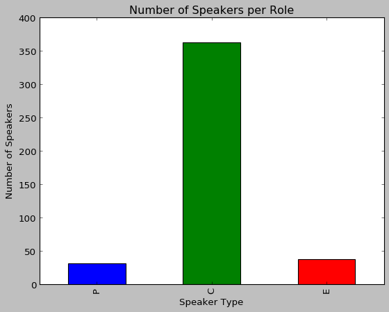


There are a lot of Callers, but very few presenters and experts in the corpus. This is because many callers call in during the show, while Presenters and Experts have a more steady position in each show.

### How many Males vs. Females?
- 218 Males
- 212 Females

Number of Males and Females are about equal with slightly more Males.


```python
figure=speaker_df["Gender"].value_counts().reindex(["M","F"]).plot.bar()
speaker_df["Gender"].value_counts().reindex(["M","F"])
plt.title("Number of Males and Females")
plt.xlabel("Gender")
plt.ylabel("Number of Speakers")
plt.show()

# saving the figure
figure.figure.savefig("images/gender_totals.png")
```


    M    218
    F    212
    Name: Gender, dtype: int64


    <matplotlib.text.Text object at 0x0AEBFB70>


    <matplotlib.text.Text object at 0x0B3691F0>


    <matplotlib.text.Text object at 0x0AEBAA50>


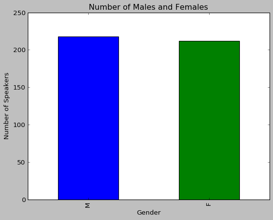


### How are Males and Females distributed across Roles?


```python
# Presenters:
fig1 = P_df["Gender"].value_counts().reindex(["M","F"]).plot.bar()
P_df["Gender"].value_counts().reindex(["M","F"])
plt.title("Male vs. Female Presenters")
plt.xlabel("Gender")
plt.ylabel("Number of Speakers")
plt.show()

# saving the figure
fig1.figure.savefig("images/presenter_genders.png")

# Callers:
fig2 = C_df["Gender"].value_counts().reindex(["M","F"]).plot.bar()
C_df["Gender"].value_counts().reindex(["M","F"])
plt.title("Male vs. Female Callers")
plt.xlabel("Gender")
plt.ylabel("Number of Speakers")
plt.show()

# saving the figure
fig2.figure.savefig("images/caller_genders.png")

# Experts:
fig3 = E_df["Gender"].value_counts().reindex(["M","F"]).plot.bar()
E_df["Gender"].value_counts().reindex(["M","F"])
plt.title("Male vs. Female Experts")
plt.xlabel("Gender")
plt.ylabel("Number of Speakers")
plt.show()

# saving the figure
fig3.figure.savefig("images/expert_genders.png")
```


    M    21
    F    10
    Name: Gender, dtype: int64


    <matplotlib.text.Text object at 0x0AF0CF70>


    <matplotlib.text.Text object at 0x0AEF2D50>


    <matplotlib.text.Text object at 0x0AF030F0>


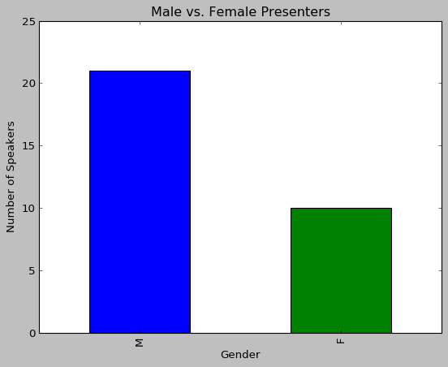


    M    171
    F    191
    Name: Gender, dtype: int64


    <matplotlib.text.Text object at 0x0B08F390>


    <matplotlib.text.Text object at 0x0AF25BD0>


    <matplotlib.text.Text object at 0x0B080310>


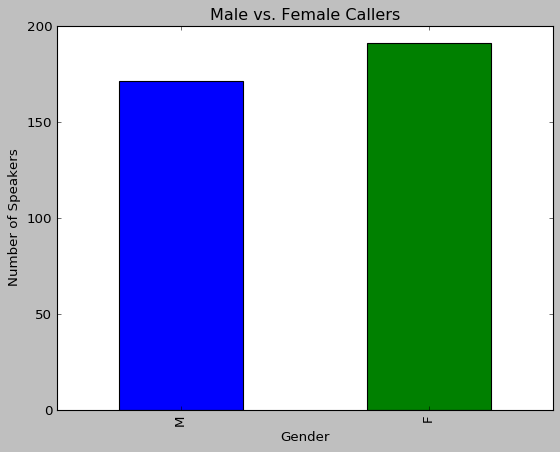


    M    26
    F    11
    Name: Gender, dtype: int64


    <matplotlib.text.Text object at 0x0AF4B1F0>


    <matplotlib.text.Text object at 0x0B0B7E70>


    <matplotlib.text.Text object at 0x0B0BC030>


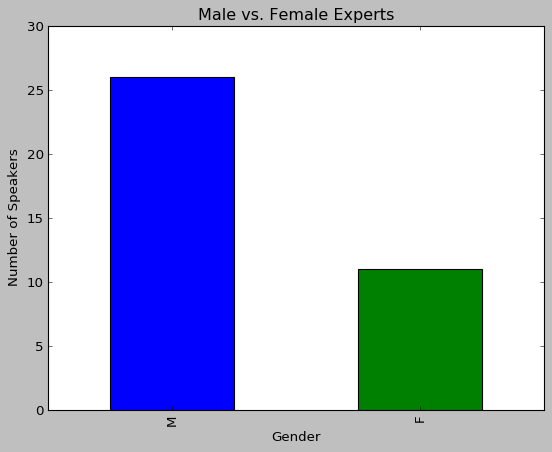


### Gender Equality

**Ratio of Gender by Role (Male : Female):**
- Presenters: 2.1 : 1
- Callers: .895 : 1
- Experts: 2.36: 1

There are about twice as many Male Presenters and Experts as compared to Females, but about equal numbers of Male and Female Callers, with slightly more Females.

**Conclusion:** Presenters and Experts are predominantly Male and Callers are more equally distributed but with more Females than Males.

Presenters are the show's hosts, hired by the program. Experts are professionals talking about their line of work. Callers however can be anyone who calls the radio station. Presenters and Experts are the people chosen by the radio to talk, and they are mostly males. Why are there more men than women working in this radio station? Is radio a generally predominantly male industry across the US?

**Further Analysis Needed:** I will do further research and analysis on gender equality before making conclusions about the Australian Radio Talkback Corpus.

## Comparison by Speaker Type
- Number of Turns
- Number of Sentences
- Number of Words
- Average Word Length
- Average Sentence Length
- Average Number of Turns


```python
# Comparing Presenter, Caller, and Expert Data Frames

# this gives a table of all the information
P_df.describe()
C_df.describe()
E_df.describe()


# SHOULD THIS SUMMARY BE HERE OR IN THE MARKDOWN CELL BELOW?
print("Summary of Important Information:")
print("Presenters:")
print("Total Number of Turns:\t",str(P_df["Number_of_Utterances"].sum())) # 1470
print("Average Number of Turns:",str(P_df["Number_of_Utterances"].mean())) # 122.5
print("Standard Deviation:\t",str(P_df["Number_of_Utterances"].std())) # 129.38

print("\nCallers:")
print("Total Number of Turns:\t",C_df["Number_of_Utterances"].sum()) # 1505
print("Average Number of Turns:",str(C_df["Number_of_Utterances"].mean()))  # 11.23
print("Standard Deviation:\t",str(C_df["Number_of_Utterances"].std())) # 7.97

      
print("\nExperts:")
print("Total Number of Turns:\t",str(E_df["Number_of_Utterances"].sum())) # 1464
print("Average Number of Turns:",str(E_df["Number_of_Utterances"].mean()))  # 91.5
print("Standard Deviation:\t",str(E_df["Number_of_Utterances"].std())) # 86.82
```


<div>
<style scoped>
    .dataframe tbody tr th:only-of-type {
        vertical-align: middle;
    }

    .dataframe tbody tr th {
        vertical-align: top;
    }

    .dataframe thead th {
        text-align: right;
    }
</style>
<table border="1" class="dataframe">
  <thead>
    <tr style="text-align: right;">
      <th></th>
      <th>Number_of_Utterances</th>
    </tr>
  </thead>
  <tbody>
    <tr>
      <th>count</th>
      <td>31.000000</td>
    </tr>
    <tr>
      <th>mean</th>
      <td>113.838710</td>
    </tr>
    <tr>
      <th>std</th>
      <td>96.088188</td>
    </tr>
    <tr>
      <th>min</th>
      <td>23.000000</td>
    </tr>
    <tr>
      <th>25%</th>
      <td>59.500000</td>
    </tr>
    <tr>
      <th>50%</th>
      <td>71.000000</td>
    </tr>
    <tr>
      <th>75%</th>
      <td>136.000000</td>
    </tr>
    <tr>
      <th>max</th>
      <td>491.000000</td>
    </tr>
  </tbody>
</table>
</div>


<div>
<style scoped>
    .dataframe tbody tr th:only-of-type {
        vertical-align: middle;
    }

    .dataframe tbody tr th {
        vertical-align: top;
    }

    .dataframe thead th {
        text-align: right;
    }
</style>
<table border="1" class="dataframe">
  <thead>
    <tr style="text-align: right;">
      <th></th>
      <th>Number_of_Utterances</th>
    </tr>
  </thead>
  <tbody>
    <tr>
      <th>count</th>
      <td>362.000000</td>
    </tr>
    <tr>
      <th>mean</th>
      <td>8.627072</td>
    </tr>
    <tr>
      <th>std</th>
      <td>6.729160</td>
    </tr>
    <tr>
      <th>min</th>
      <td>1.000000</td>
    </tr>
    <tr>
      <th>25%</th>
      <td>4.000000</td>
    </tr>
    <tr>
      <th>50%</th>
      <td>7.000000</td>
    </tr>
    <tr>
      <th>75%</th>
      <td>12.000000</td>
    </tr>
    <tr>
      <th>max</th>
      <td>63.000000</td>
    </tr>
  </tbody>
</table>
</div>


<div>
<style scoped>
    .dataframe tbody tr th:only-of-type {
        vertical-align: middle;
    }

    .dataframe tbody tr th {
        vertical-align: top;
    }

    .dataframe thead th {
        text-align: right;
    }
</style>
<table border="1" class="dataframe">
  <thead>
    <tr style="text-align: right;">
      <th></th>
      <th>Number_of_Utterances</th>
    </tr>
  </thead>
  <tbody>
    <tr>
      <th>count</th>
      <td>37.000000</td>
    </tr>
    <tr>
      <th>mean</th>
      <td>64.243243</td>
    </tr>
    <tr>
      <th>std</th>
      <td>76.512310</td>
    </tr>
    <tr>
      <th>min</th>
      <td>6.000000</td>
    </tr>
    <tr>
      <th>25%</th>
      <td>18.000000</td>
    </tr>
    <tr>
      <th>50%</th>
      <td>27.000000</td>
    </tr>
    <tr>
      <th>75%</th>
      <td>87.000000</td>
    </tr>
    <tr>
      <th>max</th>
      <td>294.000000</td>
    </tr>
  </tbody>
</table>
</div>


    Summary of Important Information:
    Presenters:
    Total Number of Turns:	 3529
    Average Number of Turns: 113.838709677
    Standard Deviation:	 96.0881875412
    
    Callers:
    Total Number of Turns:	 3123
    Average Number of Turns: 8.6270718232
    Standard Deviation:	 6.72915982542
    
    Experts:
    Total Number of Turns:	 2377
    Average Number of Turns: 64.2432432432
    Standard Deviation:	 76.5123103405
    


```python
# data frames for Presenter, Caller, and Expert Lines
P_art_df=art_df.loc[art_df["Speaker_Type"]=='P',:]
C_art_df=art_df.loc[art_df["Speaker_Type"]=='C',:]
E_art_df=art_df.loc[art_df["Speaker_Type"]=='E',:]
```


```python
# Presenter vs. Caller vs. Experts

# utterances
print("Turns:")
art_df["Speaker_Type"].value_counts().reindex(["P","C","E"])

# sentences
print("Number of Sentences:")
P_art_df["Num_Sents"].sum()
C_art_df["Num_Sents"].sum() 
E_art_df["Num_Sents"].sum()

# words
print("Number of Words:")
P_art_df["Num_Words"].sum()
C_art_df["Num_Words"].sum() 
E_art_df["Num_Words"].sum()

# avg word length
print("Average Word Length:")
P_art_df["Avg_Word_Length"].mean()
C_art_df["Avg_Word_Length"].mean()
E_art_df["Avg_Word_Length"].mean()

# avg sent length
print("Average Sentence Length:")
P_art_df["Num_Words"].sum()/P_art_df["Num_Sents"].sum()
C_art_df["Num_Words"].sum()/C_art_df["Num_Sents"].sum() 
E_art_df["Num_Words"].sum()/E_art_df["Num_Sents"].sum() 

print("Average Number of Turns:")
P_df["Number_of_Utterances"].mean()
C_df["Number_of_Utterances"].mean()
E_df["Number_of_Utterances"].mean()
```

    Turns:
    


    P    3529
    C    3123
    E    2377
    Name: Speaker_Type, dtype: int64


    Number of Sentences:
    


    5276


    4653


    4064


    Number of Words:
    


    87282


    82759


    94808


    Average Word Length:
    


    3.507288378196753


    3.2425688455302364


    3.4460386862363968


    Average Sentence Length:
    


    16.543214556482184


    17.786159467010531


    23.328740157480315


    Average Number of Turns:
    


    113.83870967741936


    8.6270718232044192


    64.243243243243242


### Analysis

Summary of Numbers Above:
- Total Number of Turns:
    - Presenters > Callers > Experts 
- Total Number of Sentences:
    - Presenters > Callers > Experts
- Total Number of Words:
    - Experts > Presenters > Callers
- Average Word Length:
    - About Equal
- Average Sentence Length:
    - Expert > Caller > Presenter 
        - Presenter and Callers are about equal 
- Average Number of Turns:
    - Presenters > Experts > Callers

Important Discoveries:
- More Callers with fewer turns
- Fewer Presenters with more turns
- Experts have the longest sentences

On average, Presenters speak the most throughout the Australian Radio Talkback Corpus. There are many Callers in each show, but they do not speak for very long. The Presenters probably talk the most because they are leading the show. 

Across the corpus, **the Presenters have the most turns and sentences, followed by Callers and then Experts.**
    
Average sentence length is much more indicative of speaker type than word length. Based on the Australian Radio Talkback Corpus, **Experts' sentences are the longest** with an average of about 23 words per sentence, while Callers have on average 17 words per sentence and Presenters about 16 words per sentence. Without a statistical analysis, I cannot be certain whether or not this finding is significant for this data. However, this finding makes sense, because Experts will talk at length about their topic, so they may have longer, more complicated sentences.

## Comparison by Gender
- Number of Turns
- Number of Sentences
- Number of Words
- Average Word Length
- Average Sentence Length
- Average Number of Turns


```python
# Males vs. Females 

# utterances
print("Utterances:")
art_df["Gender"].value_counts().reindex(["M","F"])

# data frames for male and female lines
M_art_df=art_df.loc[art_df["Gender"]=='M',:]
F_art_df=art_df.loc[art_df["Gender"]=='F',:]

# sentences
print("Number of Sentences:")
M_art_df["Num_Sents"].sum()
F_art_df["Num_Sents"].sum() 

# words
print("Number of Words:")
M_art_df["Num_Words"].sum()
F_art_df["Num_Words"].sum() 

# avg word length
print("Average Word Length:")
M_art_df["Avg_Word_Length"].mean()
F_art_df["Avg_Word_Length"].mean()

# avg sent length
print("Average Sentence Length:")
M_art_df["Num_Words"].sum()/M_art_df["Num_Sents"].sum()
F_art_df["Num_Words"].sum()/F_art_df["Num_Sents"].sum()

# building male and female data frames from speaker_df
M_df=speaker_df.loc[speaker_df["Gender"]=='M',:]
F_df=speaker_df.loc[speaker_df["Gender"]=='F',:]

print("Average Number of Turns:")
M_df["Number_of_Utterances"].mean()
F_df["Number_of_Utterances"].mean()
```

    Utterances:
    


    M    4995
    F    4034
    Name: Gender, dtype: int64


    Number of Sentences:
    


    8039


    5954


    Number of Words:
    


    158401


    106448


    Average Word Length:
    


    3.4604173885660998


    3.3242965524401384


    Average Sentence Length:
    


    19.704067670108223


    17.878401074907625


    Average Number of Turns:
    


    22.912844036697248


    19.028301886792452


Summary of Key Information:
- Number of Turns:
    - Males > Females
- Number of Sentences:
    - Males > Females
- Number of Words:
    - Males > Females
- Average Word Length:
    - About Equal
- Average Sentence Length:
    - Males > Females
- Average Number of Turns:
    - Males > Females
    
As previously stated, Presenters and Experts are predominantly male, while Callers have slightly more Females. Thus, men are in roles that talk more throughout the corpus, meaning that **men have more opportunities to talk in the corpus because of their roles.**

## Back Channels


### What are the Back Channels? Which ones are most common?


```python
bk_df["Back_Channel"].value_counts()[:20]
bk_df["Back_Channel"].value_counts()[-20:]
```


    mm              625
    yeah            576
    laughs          450
    yes             342
    inaudible       303
    mhm             232
    right           174
    laugh           150
    yep             140
    okay             90
    oh               66
    uh               52
    no               41
    oh okay          31
    ah               27
    um               24
    that's right     24
    thank you        20
    alright          19
    well             18
    Name: Back_Channel, dtype: int64


    the head of a match                1
    yes that's it                      1
    ac                                 1
    it it it it                        1
    aren't I good                      1
    it it's                            1
    good old Robert yep                1
    beautiful shirt                    1
    I haven't                          1
    yeah bit s bit s                   1
    a and was very political           1
    oh you could have                  1
    oh they are                        1
    set square                         1
    I was reading about him            1
    sprog no                           1
    that's that's                      1
    and you just keep eating eating    1
    uh the worst                       1
    oh what a                          1
    Name: Back_Channel, dtype: int64


```python
figure = bk_df["Back_Channel"].value_counts()[:20].plot.bar()
plt.title("Top 20 Back Channels")
plt.xlabel("Back Channel")
plt.ylabel("Number of Occurances")
plt.show()

# saving the figure
figure.figure.savefig("images/top_20_back_channels.png")
```


    <matplotlib.text.Text object at 0x0AF9A9B0>


    <matplotlib.text.Text object at 0x0AF72C10>


    <matplotlib.text.Text object at 0x0AF78070>


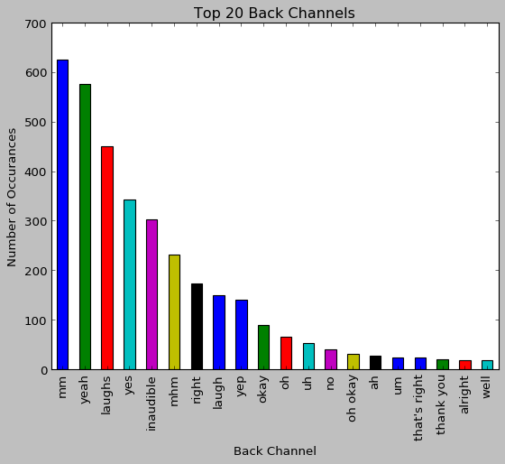


Unfortunately, a lot of the back channels were inaudible, with 303 being inaudible. However, the top back channels make sense and I do not expect that having the inaudible utterances would impact the results greatly.

Laughter is marked as plural and singlular because when 2 speakers laughed at the same time, the format was <speaker1 and speaker2 laugh>.


```python
# What speakers uttered the most Back Channels?
bk_df["Speaker"].value_counts()[:20]
```


    COMNE4-E1    270
    NAT8-P1      195
    COME3-E1     147
    ABCE2-E1     146
    COMNE1-P1    140
    COMNE1-P2    124
    COME1-E1     110
    NAT4-P1       98
    ABCE3-P1      94
    ABCE2-E2      93
    COMNE4-P1     90
    NAT1-P1       80
    ABCE1-E1      79
    COME5-P2      75
    ABCE2-P1      66
    ABCE3-P2      54
    COME6-P1      51
    COMNE5-P1     50
    ABCNE2-E1     50
    NAT6-E1       46
    Name: Speaker, dtype: int64


### What Speaker Type has the most Back Channels?


```python
# number of back channels per speaker type
bk_df["Speaker_Type"].value_counts().reindex(["P","C","E"])
```


    P    1625
    C    1691
    E    1328
    Name: Speaker_Type, dtype: int64


```python
figure = bk_df["Speaker_Type"].value_counts().reindex(["P","C","E"]).plot.bar()
plt.title("Back Channels by Speaker Type")
plt.xlabel("Speaker Type")
plt.ylabel("Number of Back Channels")
plt.show()

# saving the figure
figure.figure.savefig("images/back_channel_speaker_types.png")
```


    <matplotlib.text.Text object at 0x0B010F50>


    <matplotlib.text.Text object at 0x0AFEE410>


    <matplotlib.text.Text object at 0x0AFE1850>


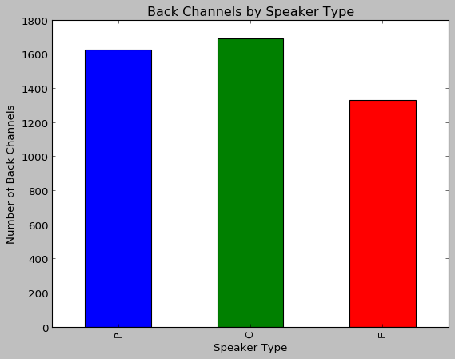


Callers (closely followed by Presenters) utter the most Back Channels.

**Conclusions:** 
- There are many Callers with few lines each, so they're constantly hearing new information upon being introduced to the show.
- Presenters stay throughout the entire show, so they have plenty of opportunities to utter back channels.
- Experts have the fewest number of turns and sentences, and their biggest purpose is to explain a complicated topic. This means that the other speakers will be uttering more back channels for the complicated topics.

### What Speaker Type has the most number of Back Channels uttered during their lines?


```python
bk_df["Line_Speaker_Type"].value_counts().reindex(["P","C","E"])
```


    P    1612
    C    1454
    E    1580
    Name: Line_Speaker_Type, dtype: int64


```python
figure = bk_df["Line_Speaker_Type"].value_counts().reindex(["P","C","E"]).plot.bar()
plt.title("Back Channels by Line Speaker Type")
plt.xlabel("Line Speaker Type")
plt.ylabel("Number of Back Channels")
plt.show()

# saving the figure
figure.figure.savefig("images/back_channel_line_speaker_types.png")
```


    <matplotlib.text.Text object at 0x0B055590>


    <matplotlib.text.Text object at 0x0B0284F0>


    <matplotlib.text.Text object at 0x0B046070>


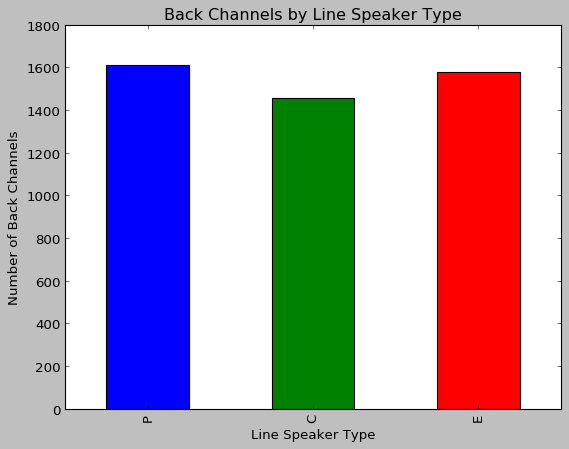


Presenter Lines have the most number of Back Channels, closely followed by Expert Lines. There are over 1000 fewer Caller lines containing back channels. 

I believe Experts and Presenters have more back channels uttered while they are talking, because:
- Experts have the longest sentences and are giving detailed information for many of their lines, so Presenters and Callers would utter back channels to show they are listening (and maybe understanding).
- Presenters are taking many turns and uttering more sentences, so there is more information coming from the Presenters.

**Potential Conclusion:** More turns and sentences and longer sentences lead to more back channels.

### What Gender utters the most Back Channels?

For my back channel gender analysis, please visit my [Final Report](https://github.com/Data-Science-for-Linguists/Discourse-Analysis-ART-Corpus/blob/master/final_report.md#72-kieran-snyder-men-interrupt-more-than-women) for information about the Language Log article [*Men Interrupt More Than Women*](http://languagelog.ldc.upenn.edu/nll/?p=13422) by Kieran Snyder.


```python
# number of back channels per gender
bk_df["Speaker_Gender"].value_counts().reindex(["M","F"])

figure = bk_df["Speaker_Gender"].value_counts().reindex(["M","F"]).plot.bar()
plt.title("Back Channels by Speaker Gender")
plt.xlabel("Speaker Gender")
plt.ylabel("Number of Back Channels")
plt.show()

# saving the figure
figure.figure.savefig("images/back_channel_speaker_genders.png")
```


    M    2403
    F    2243
    Name: Speaker_Gender, dtype: int64


    <matplotlib.text.Text object at 0x0BB44AF0>


    <matplotlib.text.Text object at 0x0BB319F0>


    <matplotlib.text.Text object at 0x0BB38A30>


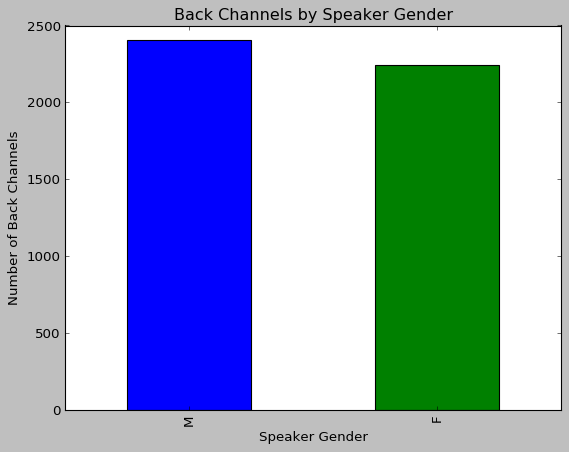


### What Gender has the most Back Channels uttered while they are speaking?


```python
# number of lines with back channels per gender
bk_df["Line_Speaker_Gender"].value_counts().reindex(["M","F"])

figure = bk_df["Line_Speaker_Gender"].value_counts().reindex(["M","F"]).plot.bar()
plt.title("Back Channels by Line Speaker Gender")
plt.xlabel("Line Speaker Gender")
plt.ylabel("Number of Back Channels")
plt.show()

# saving the figure
figure.figure.savefig("images/back_channel_line_speaker_genders.png")
```


    M    2575
    F    2071
    Name: Line_Speaker_Gender, dtype: int64


    <matplotlib.text.Text object at 0x0BD64D70>


    <matplotlib.text.Text object at 0x0BB5F410>


    <matplotlib.text.Text object at 0x0BD54B90>


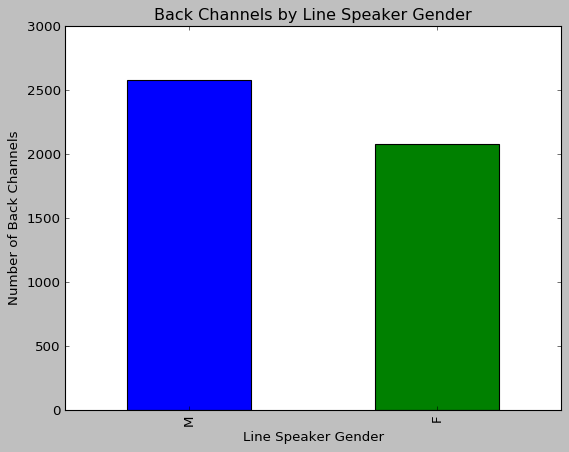


**Conclusion:** Men produced more back channels, and more back channels were uttered while they were talking.

### Are Men more likely to utter Back Channels when a Women or Man is speaking? How about the other way around?


```python
# Male Back Channels
M_bk_df=bk_df.loc[bk_df["Speaker_Gender"]=='M',:]
                  
# Female Back Channels
F_bk_df=bk_df.loc[bk_df["Speaker_Gender"]=='F',:]

# peaking at the data frames
M_bk_df.head()
F_bk_df.head()
```


<div>
<style scoped>
    .dataframe tbody tr th:only-of-type {
        vertical-align: middle;
    }

    .dataframe tbody tr th {
        vertical-align: top;
    }

    .dataframe thead th {
        text-align: right;
    }
</style>
<table border="1" class="dataframe">
  <thead>
    <tr style="text-align: right;">
      <th></th>
      <th>Speaker</th>
      <th>Speaker_Type</th>
      <th>Speaker_Gender</th>
      <th>Back_Channel</th>
      <th>Line_Speaker</th>
      <th>Segment_Utterance_Number</th>
      <th>Segment</th>
      <th>Line_Speaker_Type</th>
      <th>Line_Speaker_Gender</th>
    </tr>
    <tr>
      <th></th>
      <th></th>
      <th></th>
      <th></th>
      <th></th>
      <th></th>
      <th></th>
      <th></th>
      <th></th>
      <th></th>
    </tr>
  </thead>
  <tbody>
    <tr>
      <th>0</th>
      <td>ABCE1-E1</td>
      <td>E</td>
      <td>M</td>
      <td>sounds reasonable</td>
      <td>ABCE1-P1</td>
      <td>3</td>
      <td>ABCE1</td>
      <td>P</td>
      <td>M</td>
    </tr>
    <tr>
      <th>2</th>
      <td>ABCE1-P1</td>
      <td>P</td>
      <td>M</td>
      <td>yes</td>
      <td>ABCE1-C1</td>
      <td>11</td>
      <td>ABCE1</td>
      <td>C</td>
      <td>F</td>
    </tr>
    <tr>
      <th>3</th>
      <td>ABCE1-E1</td>
      <td>E</td>
      <td>M</td>
      <td>mm</td>
      <td>ABCE1-C1</td>
      <td>11</td>
      <td>ABCE1</td>
      <td>C</td>
      <td>F</td>
    </tr>
    <tr>
      <th>4</th>
      <td>ABCE1-E1</td>
      <td>E</td>
      <td>M</td>
      <td>mm</td>
      <td>ABCE1-C1</td>
      <td>11</td>
      <td>ABCE1</td>
      <td>C</td>
      <td>F</td>
    </tr>
    <tr>
      <th>5</th>
      <td>ABCE1-E1</td>
      <td>E</td>
      <td>M</td>
      <td>mm</td>
      <td>ABCE1-C1</td>
      <td>11</td>
      <td>ABCE1</td>
      <td>C</td>
      <td>F</td>
    </tr>
  </tbody>
</table>
</div>


<div>
<style scoped>
    .dataframe tbody tr th:only-of-type {
        vertical-align: middle;
    }

    .dataframe tbody tr th {
        vertical-align: top;
    }

    .dataframe thead th {
        text-align: right;
    }
</style>
<table border="1" class="dataframe">
  <thead>
    <tr style="text-align: right;">
      <th></th>
      <th>Speaker</th>
      <th>Speaker_Type</th>
      <th>Speaker_Gender</th>
      <th>Back_Channel</th>
      <th>Line_Speaker</th>
      <th>Segment_Utterance_Number</th>
      <th>Segment</th>
      <th>Line_Speaker_Type</th>
      <th>Line_Speaker_Gender</th>
    </tr>
    <tr>
      <th></th>
      <th></th>
      <th></th>
      <th></th>
      <th></th>
      <th></th>
      <th></th>
      <th></th>
      <th></th>
      <th></th>
    </tr>
  </thead>
  <tbody>
    <tr>
      <th>1</th>
      <td>ABCE1-C1</td>
      <td>C</td>
      <td>F</td>
      <td>laughs</td>
      <td>ABCE1-P1</td>
      <td>10</td>
      <td>ABCE1</td>
      <td>P</td>
      <td>M</td>
    </tr>
    <tr>
      <th>7</th>
      <td>ABCE1-C1</td>
      <td>C</td>
      <td>F</td>
      <td>mhm</td>
      <td>ABCE1-P1</td>
      <td>14</td>
      <td>ABCE1</td>
      <td>P</td>
      <td>M</td>
    </tr>
    <tr>
      <th>8</th>
      <td>ABCE1-C1</td>
      <td>C</td>
      <td>F</td>
      <td>uh</td>
      <td>ABCE1-E1</td>
      <td>23</td>
      <td>ABCE1</td>
      <td>E</td>
      <td>M</td>
    </tr>
    <tr>
      <th>11</th>
      <td>ABCE1-C1</td>
      <td>C</td>
      <td>F</td>
      <td>laugh</td>
      <td>ABCE1-C1</td>
      <td>24</td>
      <td>ABCE1</td>
      <td>C</td>
      <td>F</td>
    </tr>
    <tr>
      <th>14</th>
      <td>ABCE1-C1</td>
      <td>C</td>
      <td>F</td>
      <td>mm</td>
      <td>ABCE1-E1</td>
      <td>31</td>
      <td>ABCE1</td>
      <td>E</td>
      <td>M</td>
    </tr>
  </tbody>
</table>
</div>


```python
print("The Gender of the Line's Speaker during All Instances of Male Back Channels:")
M_bk_df["Line_Speaker_Gender"].value_counts().reindex(["M","F"])
print("The Gender of the Line's Speaker during All Instances of Female Back Channels:")
F_bk_df["Line_Speaker_Gender"].value_counts().reindex(["M","F"])

# creating bar graphs
fig1 = M_bk_df["Line_Speaker_Gender"].value_counts().reindex(["M","F"]).plot.bar()
plt.title("Male Back Channels by Line Speaker Gender")
plt.xlabel("Line Speaker Gender")
plt.ylabel("Number of Back Channels")
plt.show()

fig2 = F_bk_df["Line_Speaker_Gender"].value_counts().reindex(["M","F"]).plot.bar()
plt.title("Female Back Channels by Line Speaker Gender")
plt.xlabel("Line Speaker Gender")
plt.ylabel("Number of Back Channels")
plt.show()

# saving the figures
fig1.figure.savefig("images/male_back_channel_line_speaker_genders.png")
fig2.figure.savefig("images/female_back_channel_line_speaker_genders.png")

```

    The Gender of the Line's Speaker during All Instances of Male Back Channels:
    


    M    1508
    F     895
    Name: Line_Speaker_Gender, dtype: int64


    The Gender of the Line's Speaker during All Instances of Female Back Channels:
    


    M    1067
    F    1176
    Name: Line_Speaker_Gender, dtype: int64


    <matplotlib.text.Text object at 0x0C2B5290>


    <matplotlib.text.Text object at 0x0BD8AD90>


    <matplotlib.text.Text object at 0x0C2A6E50>


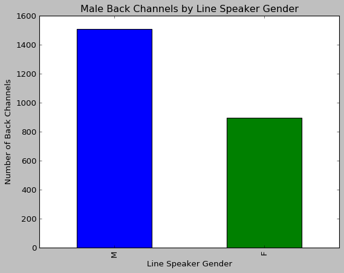


    <matplotlib.text.Text object at 0x0AF2EB30>


    <matplotlib.text.Text object at 0x0C2D2090>


    <matplotlib.text.Text object at 0x0C2D77D0>


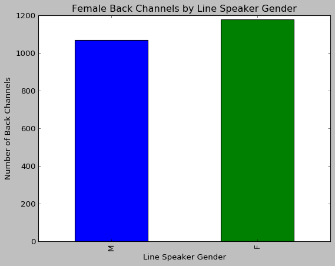


**Conclusion:** *Men* produce more Back Channels when *other men* are talking, and *Women* produce slightly more back channels when *other women* are talking.

### How do Male and Female Most Common Back Channels Compare?


```python
# Most Common Male and Female Back Channels
print("Most Common Male Back Channels:")
M_bk_df["Back_Channel"].value_counts()[:20]
print("Most Common Female Back Channels:")
F_bk_df["Back_Channel"].value_counts()[:20]

# creating graphs
fig1 = M_bk_df["Back_Channel"].value_counts()[:10].plot.bar()
plt.title("Top 10 Male Back Channels")
plt.xlabel("Back Channel")
plt.ylabel("Number of Back Channels")
plt.show()

fig2 = F_bk_df["Back_Channel"].value_counts()[:10].plot.bar()
plt.title("Top 10 Female Back Channels")
plt.xlabel("Back Channel")
plt.ylabel("Number of Back Channels")
plt.show()

# saving the figures
fig1.figure.savefig("images/top_10_male_back_channels.png")
fig2.figure.savefig("images/top_10_female_back_channels.png")
```

    Most Common Male Back Channels:
    


    mm              332
    yeah            295
    laughs          224
    inaudible       175
    yes             175
    right            96
    laugh            81
    yep              74
    mhm              70
    okay             42
    uh               30
    oh               29
    um               17
    no               16
    ah               14
    that's right     12
    oh okay          10
    well              9
    thank you         8
    alright           7
    Name: Back_Channel, dtype: int64


    Most Common Female Back Channels:
    


    mm              293
    yeah            281
    laughs          226
    yes             167
    mhm             162
    inaudible       128
    right            78
    laugh            69
    yep              66
    okay             48
    oh               37
    no               25
    uh               22
    oh okay          21
    ah               13
    alright          12
    that's right     12
    thank you        12
    uhuh             11
    well              9
    Name: Back_Channel, dtype: int64


    <matplotlib.text.Text object at 0x0C17B110>


    <matplotlib.text.Text object at 0x0C2CC410>


    <matplotlib.text.Text object at 0x0AF1C110>


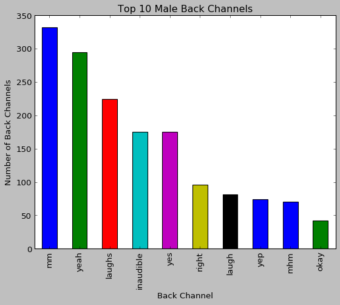


    <matplotlib.text.Text object at 0x0C1CD2D0>


    <matplotlib.text.Text object at 0x0C1735D0>


    <matplotlib.text.Text object at 0x0C1BE3B0>


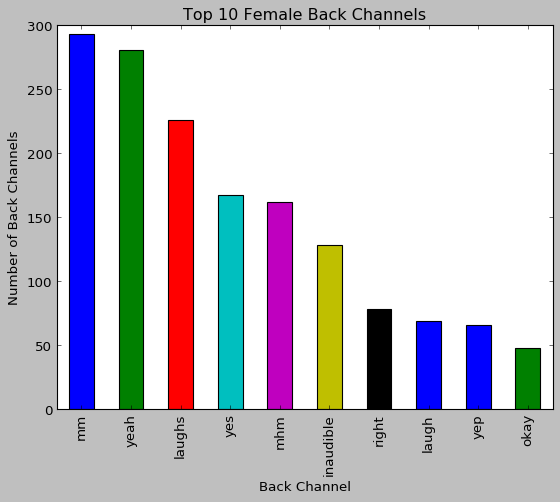


Female and Male Back Channels appear to be about the same

Next Question: How does Speaker Type Affect Men and Women's Back Channels?

## Presenter Gender Analysis


```python
# Presenter Data Frame:
P_df
P_df["Name"].value_counts().sum()
len(P_df["Name"].unique())
```


<div>
<style scoped>
    .dataframe tbody tr th:only-of-type {
        vertical-align: middle;
    }

    .dataframe tbody tr th {
        vertical-align: top;
    }

    .dataframe thead th {
        text-align: right;
    }
</style>
<table border="1" class="dataframe">
  <thead>
    <tr style="text-align: right;">
      <th></th>
      <th>Segment</th>
      <th>Speaker_Type</th>
      <th>Gender</th>
      <th>Name</th>
      <th>Number_of_Utterances</th>
    </tr>
    <tr>
      <th>Speaker</th>
      <th></th>
      <th></th>
      <th></th>
      <th></th>
      <th></th>
    </tr>
  </thead>
  <tbody>
    <tr>
      <th>ABCE1-P1</th>
      <td>ABCE1</td>
      <td>P</td>
      <td>M</td>
      <td>Simon Marnie</td>
      <td>155</td>
    </tr>
    <tr>
      <th>ABCE2-P1</th>
      <td>ABCE2</td>
      <td>P</td>
      <td>M</td>
      <td>Simon Marnie</td>
      <td>233</td>
    </tr>
    <tr>
      <th>ABCE3-P1</th>
      <td>ABCE3</td>
      <td>P</td>
      <td>F</td>
      <td>Lynne Haultain</td>
      <td>129</td>
    </tr>
    <tr>
      <th>ABCE3-P2</th>
      <td>ABCE3</td>
      <td>P</td>
      <td>F</td>
      <td>Jurate Sasnaitis</td>
      <td>56</td>
    </tr>
    <tr>
      <th>ABCE4-P1</th>
      <td>ABCE4</td>
      <td>P</td>
      <td>F</td>
      <td>Kelly Higgins-Devine</td>
      <td>23</td>
    </tr>
    <tr>
      <th>ABCNE1-P1</th>
      <td>ABCNE1</td>
      <td>P</td>
      <td>M</td>
      <td>Trevor Jackson</td>
      <td>64</td>
    </tr>
    <tr>
      <th>ABCNE2-P1</th>
      <td>ABCNE2</td>
      <td>P</td>
      <td>M</td>
      <td>Trevor Jackson</td>
      <td>58</td>
    </tr>
    <tr>
      <th>COME1-P1</th>
      <td>COME1</td>
      <td>P</td>
      <td>M</td>
      <td>Luke Bona</td>
      <td>67</td>
    </tr>
    <tr>
      <th>COME2-P1</th>
      <td>COME2</td>
      <td>P</td>
      <td>M</td>
      <td>Luke Bona</td>
      <td>68</td>
    </tr>
    <tr>
      <th>COME3-P1</th>
      <td>COME3</td>
      <td>P</td>
      <td>M</td>
      <td>Luke Bona</td>
      <td>61</td>
    </tr>
    <tr>
      <th>COME5-P1</th>
      <td>COME5</td>
      <td>P</td>
      <td>M</td>
      <td>Spencer</td>
      <td>65</td>
    </tr>
    <tr>
      <th>COME5-P2</th>
      <td>COME5</td>
      <td>P</td>
      <td>F</td>
      <td>Sharina</td>
      <td>491</td>
    </tr>
    <tr>
      <th>COME6-P1</th>
      <td>COME6</td>
      <td>P</td>
      <td>M</td>
      <td>Paul Murray</td>
      <td>116</td>
    </tr>
    <tr>
      <th>COME7-P1</th>
      <td>COME7</td>
      <td>P</td>
      <td>M</td>
      <td>Neil Mitchell</td>
      <td>56</td>
    </tr>
    <tr>
      <th>COMNE1-P1</th>
      <td>COMNE1</td>
      <td>P</td>
      <td>M</td>
      <td>Brad Hardie</td>
      <td>143</td>
    </tr>
    <tr>
      <th>COMNE1-P2</th>
      <td>COMNE1</td>
      <td>P</td>
      <td>M</td>
      <td>Adrian Barich</td>
      <td>118</td>
    </tr>
    <tr>
      <th>COMNE2-P1</th>
      <td>COMNE2</td>
      <td>P</td>
      <td>M</td>
      <td>Howard Sattler</td>
      <td>79</td>
    </tr>
    <tr>
      <th>COMNE3-P1</th>
      <td>COMNE3</td>
      <td>P</td>
      <td>M</td>
      <td>Harvey Deegan</td>
      <td>43</td>
    </tr>
    <tr>
      <th>COMNE4-P1</th>
      <td>COMNE4</td>
      <td>P</td>
      <td>M</td>
      <td>Harvey Deegan</td>
      <td>155</td>
    </tr>
    <tr>
      <th>COMNE5-P1</th>
      <td>COMNE5</td>
      <td>P</td>
      <td>M</td>
      <td>Leon Byner</td>
      <td>36</td>
    </tr>
    <tr>
      <th>COMNE6-P1</th>
      <td>COMNE6</td>
      <td>P</td>
      <td>M</td>
      <td>Graeme Goodings</td>
      <td>52</td>
    </tr>
    <tr>
      <th>COMNE7-P1</th>
      <td>COMNE7</td>
      <td>P</td>
      <td>F</td>
      <td>Nicole Haack</td>
      <td>61</td>
    </tr>
    <tr>
      <th>NAT1-P1</th>
      <td>NAT1</td>
      <td>P</td>
      <td>M</td>
      <td>Sandy McCutcheon</td>
      <td>103</td>
    </tr>
    <tr>
      <th>NAT2-P1</th>
      <td>NAT2</td>
      <td>P</td>
      <td>M</td>
      <td>Sandy McCutcheon</td>
      <td>64</td>
    </tr>
    <tr>
      <th>NAT2-P2</th>
      <td>NAT2</td>
      <td>P</td>
      <td>F</td>
      <td>Ramona Koval</td>
      <td>46</td>
    </tr>
    <tr>
      <th>NAT3-P1</th>
      <td>NAT3</td>
      <td>P</td>
      <td>F</td>
      <td>Julie McCrossin</td>
      <td>103</td>
    </tr>
    <tr>
      <th>NAT4-P1</th>
      <td>NAT4</td>
      <td>P</td>
      <td>M</td>
      <td>Tony Delroy</td>
      <td>313</td>
    </tr>
    <tr>
      <th>NAT5-P1</th>
      <td>NAT5</td>
      <td>P</td>
      <td>M</td>
      <td>John Cleary</td>
      <td>71</td>
    </tr>
    <tr>
      <th>NAT6-P1</th>
      <td>NAT6</td>
      <td>P</td>
      <td>F</td>
      <td>Mel Bampton</td>
      <td>88</td>
    </tr>
    <tr>
      <th>NAT7-P1</th>
      <td>NAT7</td>
      <td>P</td>
      <td>F</td>
      <td>Rosie Beaton</td>
      <td>224</td>
    </tr>
    <tr>
      <th>NAT8-P1</th>
      <td>NAT8</td>
      <td>P</td>
      <td>F</td>
      <td>Gaby Brown</td>
      <td>188</td>
    </tr>
  </tbody>
</table>
</div>


    31


    25


### Making Data Frames


```python
# Male and Female Presenter Data Frames:
M_P_df=P_df.loc[P_df["Gender"]=='M',:]
F_P_df=P_df.loc[P_df["Gender"]=='F',:]

M_P_df
F_P_df

print("Number of Uninque Male IDs:")
M_P_df["Name"].value_counts().sum()
print("Number of Unique Male Presenters")
len(M_P_df["Name"].unique())

print("Number of Uninque Female IDs:")
F_P_df["Name"].value_counts().sum()
print("Number of Unique Female Presenters")
len(F_P_df["Name"].unique())
```


<div>
<style scoped>
    .dataframe tbody tr th:only-of-type {
        vertical-align: middle;
    }

    .dataframe tbody tr th {
        vertical-align: top;
    }

    .dataframe thead th {
        text-align: right;
    }
</style>
<table border="1" class="dataframe">
  <thead>
    <tr style="text-align: right;">
      <th></th>
      <th>Segment</th>
      <th>Speaker_Type</th>
      <th>Gender</th>
      <th>Name</th>
      <th>Number_of_Utterances</th>
    </tr>
    <tr>
      <th>Speaker</th>
      <th></th>
      <th></th>
      <th></th>
      <th></th>
      <th></th>
    </tr>
  </thead>
  <tbody>
    <tr>
      <th>ABCE1-P1</th>
      <td>ABCE1</td>
      <td>P</td>
      <td>M</td>
      <td>Simon Marnie</td>
      <td>155</td>
    </tr>
    <tr>
      <th>ABCE2-P1</th>
      <td>ABCE2</td>
      <td>P</td>
      <td>M</td>
      <td>Simon Marnie</td>
      <td>233</td>
    </tr>
    <tr>
      <th>ABCNE1-P1</th>
      <td>ABCNE1</td>
      <td>P</td>
      <td>M</td>
      <td>Trevor Jackson</td>
      <td>64</td>
    </tr>
    <tr>
      <th>ABCNE2-P1</th>
      <td>ABCNE2</td>
      <td>P</td>
      <td>M</td>
      <td>Trevor Jackson</td>
      <td>58</td>
    </tr>
    <tr>
      <th>COME1-P1</th>
      <td>COME1</td>
      <td>P</td>
      <td>M</td>
      <td>Luke Bona</td>
      <td>67</td>
    </tr>
    <tr>
      <th>COME2-P1</th>
      <td>COME2</td>
      <td>P</td>
      <td>M</td>
      <td>Luke Bona</td>
      <td>68</td>
    </tr>
    <tr>
      <th>COME3-P1</th>
      <td>COME3</td>
      <td>P</td>
      <td>M</td>
      <td>Luke Bona</td>
      <td>61</td>
    </tr>
    <tr>
      <th>COME5-P1</th>
      <td>COME5</td>
      <td>P</td>
      <td>M</td>
      <td>Spencer</td>
      <td>65</td>
    </tr>
    <tr>
      <th>COME6-P1</th>
      <td>COME6</td>
      <td>P</td>
      <td>M</td>
      <td>Paul Murray</td>
      <td>116</td>
    </tr>
    <tr>
      <th>COME7-P1</th>
      <td>COME7</td>
      <td>P</td>
      <td>M</td>
      <td>Neil Mitchell</td>
      <td>56</td>
    </tr>
    <tr>
      <th>COMNE1-P1</th>
      <td>COMNE1</td>
      <td>P</td>
      <td>M</td>
      <td>Brad Hardie</td>
      <td>143</td>
    </tr>
    <tr>
      <th>COMNE1-P2</th>
      <td>COMNE1</td>
      <td>P</td>
      <td>M</td>
      <td>Adrian Barich</td>
      <td>118</td>
    </tr>
    <tr>
      <th>COMNE2-P1</th>
      <td>COMNE2</td>
      <td>P</td>
      <td>M</td>
      <td>Howard Sattler</td>
      <td>79</td>
    </tr>
    <tr>
      <th>COMNE3-P1</th>
      <td>COMNE3</td>
      <td>P</td>
      <td>M</td>
      <td>Harvey Deegan</td>
      <td>43</td>
    </tr>
    <tr>
      <th>COMNE4-P1</th>
      <td>COMNE4</td>
      <td>P</td>
      <td>M</td>
      <td>Harvey Deegan</td>
      <td>155</td>
    </tr>
    <tr>
      <th>COMNE5-P1</th>
      <td>COMNE5</td>
      <td>P</td>
      <td>M</td>
      <td>Leon Byner</td>
      <td>36</td>
    </tr>
    <tr>
      <th>COMNE6-P1</th>
      <td>COMNE6</td>
      <td>P</td>
      <td>M</td>
      <td>Graeme Goodings</td>
      <td>52</td>
    </tr>
    <tr>
      <th>NAT1-P1</th>
      <td>NAT1</td>
      <td>P</td>
      <td>M</td>
      <td>Sandy McCutcheon</td>
      <td>103</td>
    </tr>
    <tr>
      <th>NAT2-P1</th>
      <td>NAT2</td>
      <td>P</td>
      <td>M</td>
      <td>Sandy McCutcheon</td>
      <td>64</td>
    </tr>
    <tr>
      <th>NAT4-P1</th>
      <td>NAT4</td>
      <td>P</td>
      <td>M</td>
      <td>Tony Delroy</td>
      <td>313</td>
    </tr>
    <tr>
      <th>NAT5-P1</th>
      <td>NAT5</td>
      <td>P</td>
      <td>M</td>
      <td>John Cleary</td>
      <td>71</td>
    </tr>
  </tbody>
</table>
</div>


<div>
<style scoped>
    .dataframe tbody tr th:only-of-type {
        vertical-align: middle;
    }

    .dataframe tbody tr th {
        vertical-align: top;
    }

    .dataframe thead th {
        text-align: right;
    }
</style>
<table border="1" class="dataframe">
  <thead>
    <tr style="text-align: right;">
      <th></th>
      <th>Segment</th>
      <th>Speaker_Type</th>
      <th>Gender</th>
      <th>Name</th>
      <th>Number_of_Utterances</th>
    </tr>
    <tr>
      <th>Speaker</th>
      <th></th>
      <th></th>
      <th></th>
      <th></th>
      <th></th>
    </tr>
  </thead>
  <tbody>
    <tr>
      <th>ABCE3-P1</th>
      <td>ABCE3</td>
      <td>P</td>
      <td>F</td>
      <td>Lynne Haultain</td>
      <td>129</td>
    </tr>
    <tr>
      <th>ABCE3-P2</th>
      <td>ABCE3</td>
      <td>P</td>
      <td>F</td>
      <td>Jurate Sasnaitis</td>
      <td>56</td>
    </tr>
    <tr>
      <th>ABCE4-P1</th>
      <td>ABCE4</td>
      <td>P</td>
      <td>F</td>
      <td>Kelly Higgins-Devine</td>
      <td>23</td>
    </tr>
    <tr>
      <th>COME5-P2</th>
      <td>COME5</td>
      <td>P</td>
      <td>F</td>
      <td>Sharina</td>
      <td>491</td>
    </tr>
    <tr>
      <th>COMNE7-P1</th>
      <td>COMNE7</td>
      <td>P</td>
      <td>F</td>
      <td>Nicole Haack</td>
      <td>61</td>
    </tr>
    <tr>
      <th>NAT2-P2</th>
      <td>NAT2</td>
      <td>P</td>
      <td>F</td>
      <td>Ramona Koval</td>
      <td>46</td>
    </tr>
    <tr>
      <th>NAT3-P1</th>
      <td>NAT3</td>
      <td>P</td>
      <td>F</td>
      <td>Julie McCrossin</td>
      <td>103</td>
    </tr>
    <tr>
      <th>NAT6-P1</th>
      <td>NAT6</td>
      <td>P</td>
      <td>F</td>
      <td>Mel Bampton</td>
      <td>88</td>
    </tr>
    <tr>
      <th>NAT7-P1</th>
      <td>NAT7</td>
      <td>P</td>
      <td>F</td>
      <td>Rosie Beaton</td>
      <td>224</td>
    </tr>
    <tr>
      <th>NAT8-P1</th>
      <td>NAT8</td>
      <td>P</td>
      <td>F</td>
      <td>Gaby Brown</td>
      <td>188</td>
    </tr>
  </tbody>
</table>
</div>


    Number of Uninque Male IDs:
    


    21


    Number of Unique Male Presenters
    


    15


    Number of Uninque Female IDs:
    


    10


    Number of Unique Female Presenters
    


    10


### Presenter Distribution
- 31 Unique Speaker Ids
    - 21 Male Ids
    - 10 Female Ids
- 25 Unique Speakers
    - 15 Males
    - 10 Females
    
There are 10 unique Female IDs and 10 unique Female Presenters - **no Female presents twice.**

There are 21 unique Male IDs and 15 unique Male Presenters - Multiple Males present twice and 1 presents 3 times.

Therefore there are not only are **more males hired by the show,** but **only males presesnt multiple times.**


```python
# Male and Female Presenter Lines Data Frames:
M_P_art_df=P_art_df.loc[P_art_df["Gender"]=='M',:]
F_P_art_df=P_art_df.loc[P_art_df["Gender"]=='F',:]

M_P_art_df.head()
F_P_art_df.head()
```


<div>
<style scoped>
    .dataframe tbody tr th:only-of-type {
        vertical-align: middle;
    }

    .dataframe tbody tr th {
        vertical-align: top;
    }

    .dataframe thead th {
        text-align: right;
    }
</style>
<table border="1" class="dataframe">
  <thead>
    <tr style="text-align: right;">
      <th></th>
      <th></th>
      <th>Segment</th>
      <th>Speaker_Type</th>
      <th>Gender</th>
      <th>Text</th>
      <th>Word_Toks</th>
      <th>Num_Words</th>
      <th>Avg_Word_Length</th>
      <th>Sents</th>
      <th>Num_Sents</th>
    </tr>
    <tr>
      <th>Speaker</th>
      <th>Utterance_Number</th>
      <th></th>
      <th></th>
      <th></th>
      <th></th>
      <th></th>
      <th></th>
      <th></th>
      <th></th>
      <th></th>
    </tr>
  </thead>
  <tbody>
    <tr>
      <th rowspan="5" valign="top">ABCE1-P1</th>
      <th>1</th>
      <td>ABCE1</td>
      <td>P</td>
      <td>M</td>
      <td>Thanks for that John Hall now John Hall will b...</td>
      <td>['Thanks', 'for', 'that', 'John', 'Hall', 'now...</td>
      <td>80</td>
      <td>4.700000</td>
      <td>["Thanks for that John Hall now John Hall will...</td>
      <td>2</td>
    </tr>
    <tr>
      <th>3</th>
      <td>ABCE1</td>
      <td>P</td>
      <td>M</td>
      <td>He's also known &lt;E1 sounds reasonable&gt; for his...</td>
      <td>['He', "'s", 'also', 'known', 'for', 'his', 'a...</td>
      <td>159</td>
      <td>5.062893</td>
      <td>["He's also known  for his ability to open cos...</td>
      <td>3</td>
    </tr>
    <tr>
      <th>5</th>
      <td>ABCE1</td>
      <td>P</td>
      <td>M</td>
      <td>Jeanne Villani does and we'll find out the sec...</td>
      <td>['Jeanne', 'Villani', 'does', 'and', 'we', "'l...</td>
      <td>50</td>
      <td>3.980000</td>
      <td>["Jeanne Villani does and we'll find out the s...</td>
      <td>1</td>
    </tr>
    <tr>
      <th>6</th>
      <td>ABCE1</td>
      <td>P</td>
      <td>M</td>
      <td>Eight-triple-three-one-thousand one-eight-hund...</td>
      <td>['Eight-triple-three-one-thousand', 'one-eight...</td>
      <td>13</td>
      <td>8.692308</td>
      <td>["Eight-triple-three-one-thousand one-eight-hu...</td>
      <td>1</td>
    </tr>
    <tr>
      <th>8</th>
      <td>ABCE1</td>
      <td>P</td>
      <td>M</td>
      <td>How are you.</td>
      <td>['How', 'are', 'you', '.']</td>
      <td>4</td>
      <td>2.500000</td>
      <td>['How are you.']</td>
      <td>1</td>
    </tr>
  </tbody>
</table>
</div>


<div>
<style scoped>
    .dataframe tbody tr th:only-of-type {
        vertical-align: middle;
    }

    .dataframe tbody tr th {
        vertical-align: top;
    }

    .dataframe thead th {
        text-align: right;
    }
</style>
<table border="1" class="dataframe">
  <thead>
    <tr style="text-align: right;">
      <th></th>
      <th></th>
      <th>Segment</th>
      <th>Speaker_Type</th>
      <th>Gender</th>
      <th>Text</th>
      <th>Word_Toks</th>
      <th>Num_Words</th>
      <th>Avg_Word_Length</th>
      <th>Sents</th>
      <th>Num_Sents</th>
    </tr>
    <tr>
      <th>Speaker</th>
      <th>Utterance_Number</th>
      <th></th>
      <th></th>
      <th></th>
      <th></th>
      <th></th>
      <th></th>
      <th></th>
      <th></th>
      <th></th>
    </tr>
  </thead>
  <tbody>
    <tr>
      <th>ABCE3-P1</th>
      <th>1</th>
      <td>ABCE3</td>
      <td>P</td>
      <td>F</td>
      <td>If you haven't been with us before this how it...</td>
      <td>['If', 'you', 'have', "n't", 'been', 'with', '...</td>
      <td>31</td>
      <td>4.290323</td>
      <td>["If you haven't been with us before this how ...</td>
      <td>1</td>
    </tr>
    <tr>
      <th>ABCE3-P2</th>
      <th>2</th>
      <td>ABCE3</td>
      <td>P</td>
      <td>F</td>
      <td>Good afternoon Lynne.</td>
      <td>['Good', 'afternoon', 'Lynne', '.']</td>
      <td>4</td>
      <td>4.750000</td>
      <td>['Good afternoon Lynne.']</td>
      <td>1</td>
    </tr>
    <tr>
      <th>ABCE3-P1</th>
      <th>3</th>
      <td>ABCE3</td>
      <td>P</td>
      <td>F</td>
      <td>&lt;laughs&gt; It's like being at school. And we tal...</td>
      <td>['It', "'s", 'like', 'being', 'at', 'school', ...</td>
      <td>50</td>
      <td>3.420000</td>
      <td>[" It's like being at school.", "And we talk a...</td>
      <td>2</td>
    </tr>
    <tr>
      <th>ABCE3-P2</th>
      <th>4</th>
      <td>ABCE3</td>
      <td>P</td>
      <td>F</td>
      <td>And so yes.</td>
      <td>['And', 'so', 'yes', '.']</td>
      <td>4</td>
      <td>2.250000</td>
      <td>['And so yes.']</td>
      <td>1</td>
    </tr>
    <tr>
      <th>ABCE3-P1</th>
      <th>5</th>
      <td>ABCE3</td>
      <td>P</td>
      <td>F</td>
      <td>Wo we run.</td>
      <td>['Wo', 'we', 'run', '.']</td>
      <td>4</td>
      <td>2.000000</td>
      <td>['Wo we run.']</td>
      <td>1</td>
    </tr>
  </tbody>
</table>
</div>


### Presenter Gender Statistics


```python
# utterances
print("Number of Utterances:")
P_art_df["Gender"].value_counts().reindex(["M","F"])

# sentences:
print("Number of Sentences:")
M_P_art_df["Num_Sents"].sum()
F_P_art_df["Num_Sents"].sum()

# words
print("Number of Words:")
M_P_art_df["Num_Words"].sum()
F_P_art_df["Num_Words"].sum() 

# avg word length
print("Average Word Length:")
M_P_art_df["Avg_Word_Length"].mean()
F_P_art_df["Avg_Word_Length"].mean()

# avg sent length
print("Average Sentence Length:")
M_P_art_df["Num_Words"].sum()/M_P_art_df["Num_Sents"].sum()
F_P_art_df["Num_Words"].sum()/F_P_art_df["Num_Sents"].sum()

print("Average Number of Turns:")
M_P_df["Number_of_Utterances"].mean()
F_P_df["Number_of_Utterances"].mean()
```

    Number of Utterances:
    


    M    2120
    F    1409
    Name: Gender, dtype: int64


    Number of Sentences:
    


    3110


    2166


    Number of Words:
    


    49334


    37948


    Average Word Length:
    


    3.5423013416033178


    3.4546074112542988


    Average Sentence Length:
    


    15.863022508038584


    17.519852262234533


    Average Number of Turns:
    


    100.95238095238095


    140.90000000000001


Because there are about twice as many Male Presenters as Female Presenters, I cannot compare their raw scores directly. However, looking looking at Average Word Length, Average Sentence Length, and Average Number of Turns, it seems that Women talk more on average than Men, because **Females have a longer average sentence length and more number of turns.**

## Caller Gender Back Channel Analysis

I can look at Caller Gender Back Channels to compare back channels by gender in a more equal distribution of males and females.

### Data Frame of Caller Back Channels


```python
# Caller's saying back channels
print("Callers Uttering Back Channels:")
C_bk_df=bk_df.loc[bk_df["Speaker_Type"]=='C',:]
C_bk_df.head()
```

    Callers Uttering Back Channels:
    


<div>
<style scoped>
    .dataframe tbody tr th:only-of-type {
        vertical-align: middle;
    }

    .dataframe tbody tr th {
        vertical-align: top;
    }

    .dataframe thead th {
        text-align: right;
    }
</style>
<table border="1" class="dataframe">
  <thead>
    <tr style="text-align: right;">
      <th></th>
      <th>Speaker</th>
      <th>Speaker_Type</th>
      <th>Speaker_Gender</th>
      <th>Back_Channel</th>
      <th>Line_Speaker</th>
      <th>Segment_Utterance_Number</th>
      <th>Segment</th>
      <th>Line_Speaker_Type</th>
      <th>Line_Speaker_Gender</th>
    </tr>
    <tr>
      <th></th>
      <th></th>
      <th></th>
      <th></th>
      <th></th>
      <th></th>
      <th></th>
      <th></th>
      <th></th>
      <th></th>
    </tr>
  </thead>
  <tbody>
    <tr>
      <th>1</th>
      <td>ABCE1-C1</td>
      <td>C</td>
      <td>F</td>
      <td>laughs</td>
      <td>ABCE1-P1</td>
      <td>10</td>
      <td>ABCE1</td>
      <td>P</td>
      <td>M</td>
    </tr>
    <tr>
      <th>7</th>
      <td>ABCE1-C1</td>
      <td>C</td>
      <td>F</td>
      <td>mhm</td>
      <td>ABCE1-P1</td>
      <td>14</td>
      <td>ABCE1</td>
      <td>P</td>
      <td>M</td>
    </tr>
    <tr>
      <th>8</th>
      <td>ABCE1-C1</td>
      <td>C</td>
      <td>F</td>
      <td>uh</td>
      <td>ABCE1-E1</td>
      <td>23</td>
      <td>ABCE1</td>
      <td>E</td>
      <td>M</td>
    </tr>
    <tr>
      <th>11</th>
      <td>ABCE1-C1</td>
      <td>C</td>
      <td>F</td>
      <td>laugh</td>
      <td>ABCE1-C1</td>
      <td>24</td>
      <td>ABCE1</td>
      <td>C</td>
      <td>F</td>
    </tr>
    <tr>
      <th>14</th>
      <td>ABCE1-C1</td>
      <td>C</td>
      <td>F</td>
      <td>mm</td>
      <td>ABCE1-E1</td>
      <td>31</td>
      <td>ABCE1</td>
      <td>E</td>
      <td>M</td>
    </tr>
  </tbody>
</table>
</div>


```python
print("All Instances of Male and Female Callers Contributing Back Channels:") 
C_bk_df["Speaker_Gender"].value_counts().reindex(["M","F"])
print("All Male and Female Lines that Contained Caller Back Channels") 
C_bk_df["Line_Speaker_Gender"].value_counts().reindex(["M","F"])
```

    All Instances of Male and Female Callers Contributing Back Channels:
    


    M     541
    F    1150
    Name: Speaker_Gender, dtype: int64


    All Male and Female Lines that Contained Caller Back Channels
    


    M    821
    F    870
    Name: Line_Speaker_Gender, dtype: int64


**Observations:** 

- Female Callers uttered twice as many back channels as compared to Male Callers.
- More Females Lines had Caller Back Channels.

**Conclusion:** *Female Callers* utter more back channels and have more back channels uttered while they are talking as compared to Male callers.

### Data Frame of Caller Lines with Back Channels


```python
# Caller lines that include back channels
print("Caller Lines that Include Back Channels:")
C_line_bk_df=bk_df.loc[bk_df["Line_Speaker_Type"]=='C',:]
C_line_bk_df.head()
```

    Caller Lines that Include Back Channels:
    


<div>
<style scoped>
    .dataframe tbody tr th:only-of-type {
        vertical-align: middle;
    }

    .dataframe tbody tr th {
        vertical-align: top;
    }

    .dataframe thead th {
        text-align: right;
    }
</style>
<table border="1" class="dataframe">
  <thead>
    <tr style="text-align: right;">
      <th></th>
      <th>Speaker</th>
      <th>Speaker_Type</th>
      <th>Speaker_Gender</th>
      <th>Back_Channel</th>
      <th>Line_Speaker</th>
      <th>Segment_Utterance_Number</th>
      <th>Segment</th>
      <th>Line_Speaker_Type</th>
      <th>Line_Speaker_Gender</th>
    </tr>
    <tr>
      <th></th>
      <th></th>
      <th></th>
      <th></th>
      <th></th>
      <th></th>
      <th></th>
      <th></th>
      <th></th>
      <th></th>
    </tr>
  </thead>
  <tbody>
    <tr>
      <th>2</th>
      <td>ABCE1-P1</td>
      <td>P</td>
      <td>M</td>
      <td>yes</td>
      <td>ABCE1-C1</td>
      <td>11</td>
      <td>ABCE1</td>
      <td>C</td>
      <td>F</td>
    </tr>
    <tr>
      <th>3</th>
      <td>ABCE1-E1</td>
      <td>E</td>
      <td>M</td>
      <td>mm</td>
      <td>ABCE1-C1</td>
      <td>11</td>
      <td>ABCE1</td>
      <td>C</td>
      <td>F</td>
    </tr>
    <tr>
      <th>4</th>
      <td>ABCE1-E1</td>
      <td>E</td>
      <td>M</td>
      <td>mm</td>
      <td>ABCE1-C1</td>
      <td>11</td>
      <td>ABCE1</td>
      <td>C</td>
      <td>F</td>
    </tr>
    <tr>
      <th>5</th>
      <td>ABCE1-E1</td>
      <td>E</td>
      <td>M</td>
      <td>mm</td>
      <td>ABCE1-C1</td>
      <td>11</td>
      <td>ABCE1</td>
      <td>C</td>
      <td>F</td>
    </tr>
    <tr>
      <th>6</th>
      <td>ABCE1-P1</td>
      <td>P</td>
      <td>M</td>
      <td>mm</td>
      <td>ABCE1-C1</td>
      <td>13</td>
      <td>ABCE1</td>
      <td>C</td>
      <td>F</td>
    </tr>
  </tbody>
</table>
</div>


```python
print("All Caller Lines that Contained Back Channels (by Any Speaker Type):")
C_line_bk_df["Speaker_Gender"].value_counts().reindex(["M","F"])
print("All Instances of Male and Female Caller Lines that Contained Back Channels:")
C_line_bk_df["Line_Speaker_Gender"].value_counts().reindex(["M","F"])

```

    All Caller Lines that Contained Back Channels (by Any Speaker Type):
    


    M    814
    F    640
    Name: Speaker_Gender, dtype: int64


    All Instances of Male and Female Caller Lines that Contained Back Channels:
    


    M    711
    F    743
    Name: Line_Speaker_Gender, dtype: int64


**Observations**

- Of the Caller Lines that contained Back Channels, more of those back channels came from Males.
    - **Conclusion:** *Males* are more likely to contribute a back channel to a *Caller* than Females are.
- Of the Caller Lines that contained Back Channels, more Female Caller Lines contained back channels.
    - **Conclusion:** *Speakers* are more likely to contribute a back channel to a *Female Caller* than a Male Caller.
    
The real question is: **Are Male and Female Callers contributing more back channels to speakers of the same gender or different genders?**

### How Gender Alone Affects Back Channels

Because Callers are about equally male and female, I can negate the affect of the speaker role. Thus, this analysis shows the affect of *gender* instead of a combination of gender and speaker type.


```python
print("Male Callers Uttering Back Channels during Male and Female Lines:")
# Back Channels by Male Callers
CM=C_bk_df.loc[(C_bk_df["Speaker_Gender"]=='M') & (C_bk_df["Speaker_Type"]=="C"),:]
# uttered during Male and Female Lines
CM["Line_Speaker_Gender"].value_counts().reindex(["M","F"])

print("Female Callers Uttering Back Channels during Male and Female Lines:")
# Back Channels by Female Callers
CF=C_bk_df.loc[(C_bk_df["Speaker_Gender"]=='F') & (C_bk_df["Speaker_Type"]=="C"),:]
# uttered during Male and Female Lines
CF["Line_Speaker_Gender"].value_counts().reindex(["M","F"])

# creating bar graphs
fig1 = CM["Line_Speaker_Gender"].value_counts().reindex(["M","F"]).plot.bar()
plt.title("Male Caller Back Channels by Line Speaker Gender")
plt.xlabel("Line Speaker Gender")
plt.ylabel("Number of Back Channels")
plt.show()

fig2 = CF["Line_Speaker_Gender"].value_counts().reindex(["M","F"]).plot.bar()
plt.title("Female Caller Back Channels by Line Speaker Gender")
plt.xlabel("Line Speaker Gender")
plt.ylabel("Number of Back Channels")
plt.show()

# saving the figures
fig1.figure.savefig("images/male_caller_back_channel_line_speaker_genders.png")
fig2.figure.savefig("images/female_caller_back_channel_line_speaker_genders.png")

```

    Male Callers Uttering Back Channels during Male and Female Lines:
    


    M    318
    F    223
    Name: Line_Speaker_Gender, dtype: int64


    Female Callers Uttering Back Channels during Male and Female Lines:
    


    M    503
    F    647
    Name: Line_Speaker_Gender, dtype: int64


    <matplotlib.text.Text object at 0x0C230A70>


    <matplotlib.text.Text object at 0x0C2137B0>


    <matplotlib.text.Text object at 0x0C223870>


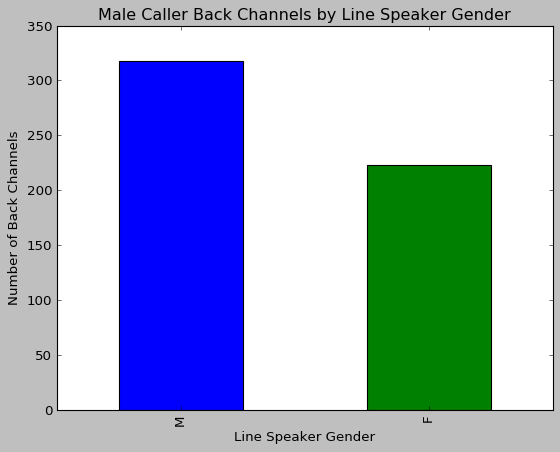


    <matplotlib.text.Text object at 0x0C270030>


    <matplotlib.text.Text object at 0x0C20CCD0>


    <matplotlib.text.Text object at 0x0C248710>


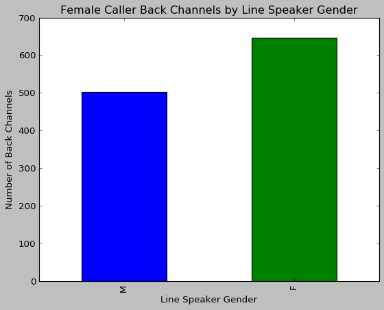


**Conclusions:**

- Female Callers collaborate more in general than male callers, as indicated by an overall higher number of Female Callers uttering back channels.
- Male Callers are more likely to collaborate with other males.
- Female Callers are more likely to collaborate with other Female Lines.


Because Caller Gender is equally distributed, I can generalize these findings to the following: **Females collaborate more than males, but males are more likely to collaborate with other males, and females are more likely to collaborate with other females.**

## Conclusion 

This concludes my analysis of the Australian Radio Talkback Corpus. Please visit my [Final Report](https://github.com/Data-Science-for-Linguists/Discourse-Analysis-ART-Corpus/blob/master/final_report.md) to see a summary of my conclusions.
