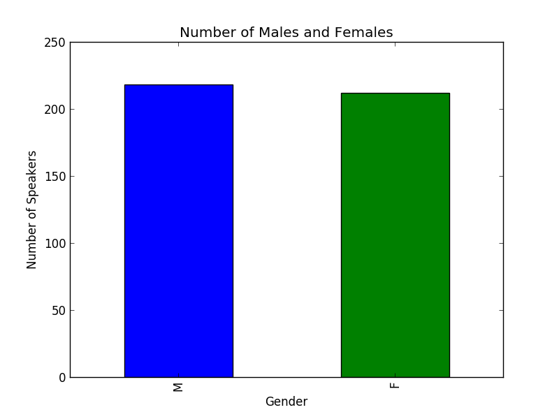

Alicia Sigmon

als333@pitt.edu

12/11/2017

# Final Report

### Table of Contents

- [1. Overview of the Discourse Analysis Project](#1.-Overview-of-the-Discourse-Analysis-Project) 
	- [1.1 Choosing a Topic and Finding Data](#1.1-Choosing-a-Topic-and-Finding-Data)
	- [1.2 The Australian Radio Talkback Corpus](#1.2-The-Australian-Radio-Talkback-Corpus)
		- [1.2.1 Format of the Australian Radio Talkback Corpus Raw Files](#1.2.1-Format-of-the-Australian-Radio-Talkback-Corpus-Raw-Files)
	- [1.3 Discourse Analysis](#1.3-Discourse-Analysis)
	- [1.4 Presentation](#1.4-Presentation)
		- [1.4.1 Data Frames Overview](#1.4.1-Data-Frames-Overview)
		- [1.4.2 Bar Graphs](#1.4.2-Bar-Graphs)
- [2. Choosing a License](#2.-Choosing-a-License)
	- [2.1 The MIT License](#2.1-The-MIT-License)
	- [2.2 Why an Open License?](#2.2-Why-an-Open-License?)
- [3. Reformatting Data](#3.-Reformatting-Data)
	- [3.1 Reading in the Texts](#Reading-in-the-Texts)
		- [3.1.1 Method 1 (Lists)](#3.1-Method-1-(Lists))
		- [3.1.2 Method 2 (Dictionary)](#3.2-Method-2-(Dictionary))
	- [3.2 Unique Speaker IDs](#3.2-Unique-Speaker-IDs)
	- [3.3 Data Frames](#3.3-Data-Frames)
		- [3.3.1 Speaker Data Frame](#3.3.1-Speaker-Data-Frame)
		- [3.3.2 Text Data Frame](#3.3.2-Text-Data-Frame)
		- [3.3.3 Back Channel Data Frame](#3.3.3-Back-Channel-Data-Frame)
- [4. Data Formatting Errors](#4.-Data-Formatting-Errors)
- [5. Distribution of Speakers by Type and Gender](#Distribution-of-Speakers-by-Type-and-Gender)
	- [5.1 Speakers per Role](#5.1-Speakers-per-Role)
	- [5.2 Speakers per Gender](#5.2-Speakers-per-Gender)
	- [5.3 Males and Females per Role](#5.3-Males-and-Females-per-Role)
- [6. Speaker Type Analysis](#6.-Speaker-Type-Analysis) 
- [7. Gender Analysis](#7.-Gender-Analysis)
- [8. Back Channels](#8.-Back-Channels)
    - [8.1 Back Channel Distribution by Speaker Type](#8.1-Back-Channel-Distribution-by-Speaker-Type)
    - [8.2 Back Channel Distribution by Gender](#8.2-Back-Channel-Distribution-by-Gender)
- [Caller Back Channel Analysis](#Caller-Back-Channel-Analysis)
- [Future Work](#Future-Work)

## 1. Overview of the Discourse Analysis Project

Please visit my [Project Plan](https://github.com/Data-Science-for-Linguists/Discourse-Analysis-ART-Corpus/blob/master/project_plan.md) 
to see a bulleted version of my plan.

### 1.1 Choosing a Topic and Finding Data

When I originally began this project, my goal was to compare Dialects of English. One of the first data sources that I found was the Australian Radio
Talkback Corpus, which is still used for this project. I also looked at BNC Baby and used the Twitter IPA to scrape tweets from Australia. The work for this
orignal idea can be found in the folder [previous_code](https://github.com/Data-Science-for-Linguists/Discourse-Analysis-ART-Corpus/tree/master/previous_code).
The code for how I found tweets is in [twitter.ipynb](https://github.com/Data-Science-for-Linguists/Discourse-Analysis-ART-Corpus/blob/master/previous_code/twitter.ipynb)
and my [BNC Baby code](https://render.githubusercontent.com/view/ipynb?commit=6f7f8ef7ec89b5503b8588046a299712bc38dcec&enc_url=68747470733a2f2f7261772e67697468756275736572636f6e74656e742e636f6d2f446174612d536369656e63652d666f722d4c696e6775697374732f446973636f757273652d416e616c797369732d4152542d436f727075732f366637663865663765633839623535303362383538383034366132393937313262633338646365632f70726576696f75735f636f64652f776f726b696e675f6f6e5f646174612e6970796e62&nwo=Data-Science-for-Linguists%2FDiscourse-Analysis-ART-Corpus&path=previous_code%2Fworking_on_data.ipynb&repository_id=109528849&repository_type=Repository#BNC) 
and [Australian Radio Talkback Corpus code](https://render.githubusercontent.com/view/ipynb?commit=6f7f8ef7ec89b5503b8588046a299712bc38dcec&enc_url=68747470733a2f2f7261772e67697468756275736572636f6e74656e742e636f6d2f446174612d536369656e63652d666f722d4c696e6775697374732f446973636f757273652d416e616c797369732d4152542d436f727075732f366637663865663765633839623535303362383538383034366132393937313262633338646365632f70726576696f75735f636f64652f776f726b696e675f6f6e5f646174612e6970796e62&nwo=Data-Science-for-Linguists%2FDiscourse-Analysis-ART-Corpus&path=previous_code%2Fworking_on_data.ipynb&repository_id=109528849&repository_type=Repository#Australian-Radio-Talkback)
are in the file working_on_data.ipynb.

This file was abandoned part-way through because I realized that I needed to try a new topic and new methods. I then chose to do a Discourse Analysis based off of the 
Australian Radio Talkback Corpus, because it gave speaker information and had a user-friendly format, or so it seemed.

### 1.2 The Australian Radio Talkback Corpus
The [Australian Radio Talkback Corpus](https://www.ausnc.org.au/corpora/art) is freely downloadable for fair use, but is a relatively closed data set. I will 
discuss licensing later in this report, but you may click [here](https://github.com/Data-Science-for-Linguists/Discourse-Analysis-ART-Corpus/blob/master/final_report.md#choosing-a-license) 
to move to Section 1.5 of the report to learn more about the license for the corpus and how I chose the license for my code.
 
The corpus contains 27 raw and text files of transcribed recordings of national, regional, and commercial Australian
Talkback Radio. For this project, I will be using the *raw files,* because the text files do not contain speaker information. 

#### 1.2.1 Format of the Australian Radio Talkback Corpus Raw Files

The first instance of a Speaker in the Corpus is labeled as follows: [SpeakerType+Number: Name, Gender]. 
Each following instance of a speaker has an abbreviated label within a file, which includes their speaker type and number. Presenters are labeled as *P,* Callers
as *C,* and Experts as *E.* For example, in ABCE1-raw.txt, the first speaker is introduced as [Presenter 1: Simon Marnie, M]. When he speaks again, 
he is referred to as [P1]. This method is used in all files.

To see this example from the full text, please click 
[here](https://render.githubusercontent.com/view/ipynb?commit=d7e2875149d7364aab232bff885c8bdfb2e9c10a&enc_url=68747470733a2f2f7261772e67697468756275736572636f6e74656e742e636f6d2f446174612d536369656e63652d666f722d4c696e6775697374732f446973636f757273652d416e616c797369732d4152542d436f727075732f643765323837353134396437333634616162323332626666383835633862646662326539633130612f70726f636573732d6172742d636f727075732e6970796e62&nwo=Data-Science-for-Linguists%2FDiscourse-Analysis-ART-Corpus&path=process-art-corpus.ipynb&repository_id=109528849&repository_type=Repository#Getting-the-Texts) 
to visit my code. 

Also contained in the raw text files are spelling corrections, program advertisements, breaks, and music, indicated by curly brackets { }, and 
laughter, pauses, inaudible speech, and overlapping speech, indicated by angle brackets < >. 
For the purpose of this project, I ignored the items within curly brackets. I then looked at
items within angle brackets that were uttered by speakers other than the speaker of the line. I considered all overlapping speech to be a backchannel, though 
some of these "back channels" are really interruptions and should be analyzed separately. For recommendations on future research with information in the 
curly brackets and angle brackets, please 
visit my [Future Work](https://github.com/Data-Science-for-Linguists/Discourse-Analysis-ART-Corpus/blob/master/final_report.md#future-work) section. 

### 1.3 Discourse Analysis
I analyzed aspects of speech like sentence and word length, number of turns, and average number of turns to get an idea of how much the speakers were talking. 
For my main discourse analysis I decided to focus on back channels. Who is uttering back channels, and when are they uttering them? Part of each speaker's identity 
is their role in the talkback radio show and their gender. How do these factors affect the conversation? 

### 1.4 Presentation

#### 1.4.1 Data Frames Overview
In order to be able to do an analysis, I organized the data into 3 main pandas data frames. 
- speaker_df: a data frame of all unique speakers in the corpus
- art_df: a data frame of all lines of text in the corpus
- bk_df: a data frame of all back channels in the corpus

Click [here](https://render.githubusercontent.com/view/ipynb?commit=755bd39beb57f0266c9ad528edaa35107ef6f481&enc_url=68747470733a2f2f7261772e67697468756275736572636f6e74656e742e636f6d2f446174612d536369656e63652d666f722d4c696e6775697374732f446973636f757273652d416e616c797369732d4152542d436f727075732f373535626433396265623537663032363663396164353238656461613335313037656636663438312f616e616c797369732e6970796e62&nwo=Data-Science-for-Linguists%2FDiscourse-Analysis-ART-Corpus&path=analysis.ipynb&repository_id=109528849&repository_type=Repository#Data-Frames-Summary) 
to see the completed data frames.

More information about the data frames' contents, organization, and purpose can be found in [Section 3.3](#Data-Frames).

#### 1.4.2 Bar Graphs
I used bar graphs to create visualizations of speaker distributions across speaker types and speaker genders. I also created bar graphs to show the most common back channels, 
and how back channels differed between men and women. These graphs can be found in the Analysis portions of my report.

## 2. Choosing a License
The Australian Radio Talkback Corpus is a relatively closed corpus with a [limited license](https://www.ausnc.org.au/about-1/terms-of-use), 
and I am using the corpus under the Fair Dealings Policy, which is Section 3.3. Users are allowed to download one copy of the corpus, but are not allowed to re-license the data.
My *data_files* folder is then hidden from GitHub because I am not allowed to redistribute the data. However, if you would like to download the corpus for yourself, you
may do so at the [Australian National Corpus website](https://www.ausnc.org.au/corpora/art). 

At first, I thought I would be unable to license my code due to the strict regulations, but I am able to license my code as long as I am not re-licensing the 
data itself.

To read more about the process of choosing a license, please visit my [License Notes](https://github.com/Data-Science-for-Linguists/Discourse-Analysis-ART-Corpus/blob/master/license_notes.md).

### 2.1 The MIT License
The [MIT License](https://github.com/Data-Science-for-Linguists/Discourse-Analysis-ART-Corpus/blob/master/LICENSE.md) is an open license 
that will allow others to use, copy, modify, merge, publish, distribute, sublicense, and/or sell copies my code.

### 2.2 Why an Open License?
My code is useful because it fixes many errors in transcription and puts the corpus into a useable format for all files. 
Thus, I chose the MIT License because it is open source so that others can expand upon my research to further analyze discourse.

## 3. Reformatting Data
My goal in using data frames was to make the speaker information and lines of text accessable, and to be able to compare the speakers across files. 
To get the data into data frames, I had to figure out the most effective way to retrieve the data. 

### 3.1 Reading in the Texts
First I tried using *lists,* and then I tried a *dictionary,* which was much more effective. 

#### 3.1.1 Method 1 (Lists)
When I first began working with the Australian Radio Talkback Corpus, my methods were flawed. I began with a list of all lines of text, which I called [ART_lines](http://localhost:8888/notebooks/previous_code/reformatting_raw_files.ipynb#Creating-lists-for-data),
where I append each line of data directly from the files. In the following cells, I created for loops that found gender, speaker, speaker type, utterance number, 
and filename for each line and appended those values to new lists.

While the lists were equal lengths, the rows did not line up across lists, and my data format was unreliable. I also found many transcription errors and 
had to modify each list individually to correct the issues. I then decided that a dictionary would be a 
more effective, efficient, and reliable method for storing my data.

#### 3.1.2 Method 2 (Dictionary)
My second attempt involved first appending all the texts into a dictionary, which I called [rawtext_dict](https://render.githubusercontent.com/view/ipynb?commit=552c6aba66aee9b5949eb72b98891cbe82573aa5&enc_url=68747470733a2f2f7261772e67697468756275736572636f6e74656e742e636f6d2f446174612d536369656e63652d666f722d4c696e6775697374732f446973636f757273652d416e616c797369732d4152542d436f727075732f353532633661626136366165653962353934396562373262393838393163626538323537336161352f70726f636573732d6172742d636f727075732e6970796e62&nwo=Data-Science-for-Linguists%2FDiscourse-Analysis-ART-Corpus&path=process-art-corpus.ipynb&repository_id=109528849&repository_type=Repository#Getting-the-Texts), 
where the keys were the filenames and the values were the texts. This allowed me to fix transcription errors in the texts themselves instead of working in lists
of fragmented data.

### 3.2 Unique Speaker IDs
As previously discussed in the [Section 1.2.1](#Format-of-the-Australian-Radio-Talkback-Corpus-Raw-Files), each speaker is given a unique ID for within their file.
However, these identifiers do not allow for cross-file analyses. 
For example, Presenter 1 [P1] in ABCE1-raw.txt is Simon Marnie, but Presenter 1 [P1] in COME1-raw.txt is Luke Bona. My code creates a
[Unique Speaker ID ](https://render.githubusercontent.com/view/ipynb?commit=1e1745a4d0843db171a796d80b11785629c48e1e&enc_url=68747470733a2f2f7261772e67697468756275736572636f6e74656e742e636f6d2f446174612d536369656e63652d666f722d4c696e6775697374732f446973636f757273652d416e616c797369732d4152542d436f727075732f316531373435613464303834336462313731613739366438306231313738353632396334386531652f70726f636573732d6172742d636f727075732e6970796e62&nwo=Data-Science-for-Linguists%2FDiscourse-Analysis-ART-Corpus&path=process-art-corpus.ipynb&repository_id=109528849&repository_type=Repository#Creating-Unique-Speaker-Ids)
for each speaker in the corpus, corresponding to their speaker type and their file number. 
This transforms the previous two Presenter 1s from [P1] to [ABCE1-P1] and [COME1-P1].

### 3.3 Data Frames

#### 3.3.1 Speaker Data Frame
This data frame is organized by unique speaker ID and includes the following information:
- unique speaker ID
- filename
- name
- speaker type (P/C/E)
- gender (M/F)
- number of utterances

The purpose of this data frame is to have all information about unique speakers in one location, and to be able to compare the total number of utterances per speaker.

#### 3.3.2 Text Data Frame
This data frame is organized by unique speaker ID and the utterance number of the file, and includes the following information:
- unique speaker ID
- utterance number within the file
- filename
- speaker type (P/C/E)
- speaker gender (M/F)
- the line of text
- word tokens
- number of words
- average word length
- sentences
- number of sentences

The purpose of this data frame is to be able to look at word, sentence, and utterance information for speakers by speaker type and gender.

#### 3.3.3 Back Channel Data Frame
This data frame is organized by unique speaker 
- speaker
- speaker type
- speaker gender
- back channels
- line speaker
- segment utterance number
- filename
- line speaker type
- line speaker gender

The purpose of this data frame is to be able to look at information about the corpus's back channels to see who is uttering them, who has back channels uttered while they are talking, the most common back channels, etc.

## 4. Data Formatting Errors
In transcriptions there is always room for human error. In this corpus, I originally thought that the data would not be difficult to transform into data frames.
However, I discovered that the standard method of introducing speakers varied, and speakers were sometimes even mislabeled in later turns. Similarly, sometimes 
information was in the incorrect type of bracket. I created a single 
[Data Cleaning cell](https://render.githubusercontent.com/view/ipynb?commit=552c6aba66aee9b5949eb72b98891cbe82573aa5&enc_url=68747470733a2f2f7261772e67697468756275736572636f6e74656e742e636f6d2f446174612d536369656e63652d666f722d4c696e6775697374732f446973636f757273652d416e616c797369732d4152542d436f727075732f353532633661626136366165653962353934396562373262393838393163626538323537336161352f70726f636573732d6172742d636f727075732e6970796e62&nwo=Data-Science-for-Linguists%2FDiscourse-Analysis-ART-Corpus&path=process-art-corpus.ipynb&repository_id=109528849&repository_type=Repository#Data-Cleaning) 
where I added each new transcription error and fixed them in my dictionary of raw texts. 
This allowed me to append the corrected lines to my lists for the data frames.

NAT4-raw.txt specifically contained 2 files, which I separated into [NAT4-raw.txt and NAT5-raw.txt.](https://render.githubusercontent.com/view/ipynb?commit=1e1745a4d0843db171a796d80b11785629c48e1e&enc_url=68747470733a2f2f7261772e67697468756275736572636f6e74656e742e636f6d2f446174612d536369656e63652d666f722d4c696e6775697374732f446973636f757273652d416e616c797369732d4152542d436f727075732f316531373435613464303834336462313731613739366438306231313738353632396334386531652f70726f636573732d6172742d636f727075732e6970796e62&nwo=Data-Science-for-Linguists%2FDiscourse-Analysis-ART-Corpus&path=process-art-corpus.ipynb&repository_id=109528849&repository_type=Repository#Splitting-NAT4-raw.txt-into-2-files) 
The index *NAT4-raw.txt* in the dictionary of raw texts contains the first segement from the original NAT4-raw.txt, and the second segement is under the new key *NAT5-raw.txt.*

## 5. Distribution of Speakers by Type and Gender

### 5.1 Speakers per Role
To see the source of the following graph, please visit [my code](https://render.githubusercontent.com/view/ipynb?commit=41704b35f912338cacf68fce5f69cc54c5974b95&enc_url=68747470733a2f2f7261772e67697468756275736572636f6e74656e742e636f6d2f446174612d536369656e63652d666f722d4c696e6775697374732f446973636f757273652d416e616c797369732d4152542d436f727075732f343137303462333566393132333338636163663638666365356636396363353463353937346239352f616e616c797369732e6970796e62&nwo=Data-Science-for-Linguists%2FDiscourse-Analysis-ART-Corpus&path=analysis.ipynb&repository_id=109528849&repository_type=Repository#How-many-Speakers-are-there-for-each-Role?).

There are 31 Presenters, 362 Callers, and 37 Experts in the Australian Radio Talkback Corpus. 

Most files have 1-2 Presenters and Experts, with many people calling in throughout the show.

### 5.2 Speakers per Gender
To see the source of the following graph, please visit [my code](https://render.githubusercontent.com/view/ipynb?commit=41704b35f912338cacf68fce5f69cc54c5974b95&enc_url=68747470733a2f2f7261772e67697468756275736572636f6e74656e742e636f6d2f446174612d536369656e63652d666f722d4c696e6775697374732f446973636f757273652d416e616c797369732d4152542d436f727075732f343137303462333566393132333338636163663638666365356636396363353463353937346239352f616e616c797369732e6970796e62&nwo=Data-Science-for-Linguists%2FDiscourse-Analysis-ART-Corpus&path=analysis.ipynb&repository_id=109528849&repository_type=Repository#How-many-Males-vs.-Females?).

There are 218 men and 212 women in the Australian Radio Talkback Corpus.

There are about equal numbers of males and females in the corpus, but how are males and females 
distributed across speaker type?

### 5.3 Males and Females per Role
To see the source of the following graphs, please visit [my code](https://render.githubusercontent.com/view/ipynb?commit=41704b35f912338cacf68fce5f69cc54c5974b95&enc_url=68747470733a2f2f7261772e67697468756275736572636f6e74656e742e636f6d2f446174612d536369656e63652d666f722d4c696e6775697374732f446973636f757273652d416e616c797369732d4152542d436f727075732f343137303462333566393132333338636163663638666365356636396363353463353937346239352f616e616c797369732e6970796e62&nwo=Data-Science-for-Linguists%2FDiscourse-Analysis-ART-Corpus&path=analysis.ipynb&repository_id=109528849&repository_type=Repository#How-are-Males-and-Females-distributed-across-Roles?).

There are 21 male presenters and 10 female presenters.

There are 171 male callers and 191 female callers.

There are 26 male experts and 11 female experts.

Presenters, who are hired by the show, and Experts, who are professionals talking about their work, include about twice as many
males as females. Callers on the other hand are more evenly distributed with slightly more females. 
Thus it seems that men are in more positions of power in the Australian Radio Talkback Corpus. 

## 6. Speaker Type Analysis

When I did my [speaker type analysis](http://localhost:8888/notebooks/analysis.ipynb#Comparison-by-Speaker-Type), I found that Presenters overall had more turns and sentences than Callers and Experts, with Experts having the least number of total turns and sentences. Word length was insignificant, with each speaker having between 3 and 4 characters per word. This calculation includes punctuation, and I expect their average would be higher but still relatively equal. 

The findings for total number of words differ from the above findings, with Experts leading, followed by Presenters and then Callers. With the most words and the least number of sentences, **Experts had the longest sentences.** Presenters have on average about 17 words per sentence, and Callers have about 18 words per sentence, while Experts have an average of about 23 words per sentence. 
This means that while Experts are not taking as many turns, they are having monologues throughout the corpus and expounding on their topics with longer sentences.

**Average number of turns** appeared to be significant as well. On average, Presenters took 114 turns, Experts took 64 turns, and Callers only took about 9 turns. In talk shows, Presenters lead the conversation and introduce new members to the conversation, so it makes sense that they would have more turns than the other speaker types. Also, because there are many callers coming and going throughout the radio show, they would not have many turns.

## 7. Gender Analysis 

*include Languague Log Article*

## 8. Back Channels

To see the source of the following graph, please visit [my code](https://render.githubusercontent.com/view/ipynb?commit=1ae1b04ad53d43bcfd3401b88e901b25a53066b2&enc_url=68747470733a2f2f7261772e67697468756275736572636f6e74656e742e636f6d2f446174612d536369656e63652d666f722d4c696e6775697374732f446973636f757273652d416e616c797369732d4152542d436f727075732f316165316230346164353364343362636664333430316238386539303162323561353330363662322f616e616c797369732e6970796e62&nwo=Data-Science-for-Linguists%2FDiscourse-Analysis-ART-Corpus&path=analysis.ipynb&repository_id=109528849&repository_type=Repository#What-are-the-Back-Channels?-Which-ones-are-most-common?)

Unfortunately, a lot of the back channels were inaudible, with 303 being inaudible. I do not expect that having the inaudible utterances would impact the results greatly. However, the top back channels (mm, yeah, laughter, yes, right, etc..) make sense as they are one syllable, common phrases to not agreement, and laughter is a common in conversations. 

Laughter is marked as plural and singlular because when 2 speakers laughed at the same time, the format was <speaker1 and speaker2 laugh>.

### 8.1 Back Channel Distribution by Speaker Types

To see the source of the following graph, please visit [my code]().

Experts have the fewest number of turns and sentences, and their biggest purpose is to explain a complicated topic. This means that the other speakers will be uttering more back channels for the complicated topics.

As previously stated, Callers and Presenters' number of back channels is about equal, and greater than the Experts'.
I believe Callers utter a lot of back channels, because there are many Callers with few lines each, so they're constantly hearing new information upon being introduced to the show.
Differently, Presenters stay throughout the entire show, so they have plenty of opportunities to utter back channels while their guests are speaking.

To see the source of the following graph, please visit [my code]().

Presenter Lines have the most number of Back Channels, closely followed by Expert Lines. There are over 1000 fewer Caller lines containing back channels. 

I believe Experts and Presenters have more back channels uttered while they are talking, because:
- Experts have the longest sentences and are giving detailed information for many of their lines, so Presenters and Callers would utter back channels to show they are listening (and maybe understanding).
- Presenters are taking many turns and uttering more sentences, so there is more information coming from the Presenters.

**Potential Conclusion:** More turns and sentences and longer sentences lead to more back channels.

### 8.2 Back Channel Distribution by Gender

## Caller Back Channel Analysis

## Future Work

1. It would be good to keep curly bracket information so that turns can be analyzed for topic boundaries.
2. Overlapping speech in angle brackets should be sepearted into back channels, laughter, inaudible, and interruptions for analyses.
3. Are certain words, phrases, or parts of speech indicative of back channels occuring?
    - To do this, there would need to be columns for n-grams (I recommend unigrams and bigrams) before and after the back channel as well as POS Tags (as with the Stanford Parser). These could give valuable information for knowing what causes a back channel.